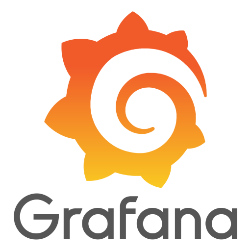

# DeltaV Edge Environment

The DeltaV Edge Environment is a platform that provides easy and secure access to DeltaV system data for on-premise use or in the cloud for monitoring, analytics, reporting or for other Enterprise applications.

## Secure Access to DeltaV System Data

Accessing plant data from a Distributed Control System such as DeltaV, can be a very complex task.
Data resides down in the Control Network and thus bringing it outside to the Enterprise network requires multiple layers of secure processing.  
The DeltaV Edge Environment simplifies data access to plant data by handling all of the security transfer from across the different network layers.  

## Data Contextualization

Extracting control system data often strips away valuable information about relationships between data points – information that exists natively within control system configurations. This loss of embedded context makes it hard to understand how the data relates to the real-world process.

DeltaV Edge Environment also manages the contextualization of data coming from the Control Network instead of by relating it to where it is being used, instead of simply presenting raw data values.  

## Easy Application Deployment 

The DeltaV Edge Environment also provides a common application platform that makes this contextual set of data available via industry standard protocols such as OPC UA and REST API, thus allowing more data consumption options through third-party applications such as Grafana, Node-RED, and JupyterLabs Notebook.  

_The intent of this github page is to provide sample code, guides, and software development kits to encourage non-Emerson developers to create their own applications that can unlock the potential of having access to such wealth of plant data, such as data analytics, graphical representation, etc._

Application Development features include:

-	Contextualized data available via OPC UA and REST API.
-	Online Cloud orchestration of Edge Nodes and Applications
-	Easy application management via Docker containers and Virtual Machines.

DeltaV Edge Environment makes the data readily accessible to the user via industry standard REST API and OPC UA endpoints. 

REST (REpresentational State Transfer) API is a web service that is based on HTTPS and provides data in JSON format, which is compatible with numerous modern data analytics applications, such as Grafana, Jupyter Notebook, Node-RED, Power BI, Excel, etc.

The OPC Unified Architecture (OPC UA) interface is a cross-platform, open-source, standard for data exchange for industrial applications.  Data accessed via OPC UA  is managed via an OPC UA Client (e.g. UaExpert, Integration Objects) connected to the DeltaV Edge Environment OPC UA endpoints.

|   |  |
|------|------|
| [REST API](developer-guide/rest-api/rest-api.md) | [OPC UA](developer-guide/opc-ua/opc-ua.md) | 

## Use with Third Party Open Source Applications:

| 

 | 

 | 

 |
|---|---|---|
| 
**Grafana**  
 | 
**Node-RED**  
 | 
<a href="https://github.com/EmersonDeltaV/jupyter-labs-for-edge">**Jupyter Notebook**
 |

https://github.com/EmersonDeltaV/jupyter-labs-for-edge

## Connect to Commercial Applications:

|  |  | 
|----------|----------|
| **Power BI**   | **Microsoft Excel**   |

# Getting Started

To get you started, here are additional info on Edge functionality, sample guides, and repositories:

-	[delta-edge-sdk](https://github.com/EmersonDeltaV/deltav-edge-sdk)
-	[simple-dockerapp-dotnet6](https://github.com/EmersonDeltaV/simple-dockerapp-dotnet6)
-	[Vincent's code](https://8b1e38e9-9001-4711-950c-437a4310f80d.mock.pstmn.io)

In-depth [Developer Guide](./developer-guide/developer-guide.md) covering:
 
- DeltaV Edge Envirorment Architecture and System Components
  
- Types and Categories of data being gathered
  
- Accessing Data via REST API
  
- Accessing Data via OPC UA
  
- Connecting to commercial applications (e.g. Power BI, Excel)
  
- Connecting to Third Party Applications within Edge Environment (e.g. Grafana, Node-RED, JupyterLabs Notebook)
  
- Creating Edge Applications in Edge App Marketplace
  

# Contributing

This project welcomes contributions, suggestions, and feedback. All contributions, suggestions, and feedback you submit are accepted under the Project's license. You represent that if you do not own copyright in the code that you have the authority to submit it under the Project's license. All feedback, suggestions, or contributions are not confidential.

For more information on how to contribute to DeltaV Edge Environment, please read [CONTRIBUTING.md](CONTRIBUTING.md]).

# References
- EDGE is based on eve-os [v9.4.6-lts](https://github.com/EmersonDeltaV/lf-edge-eve)
