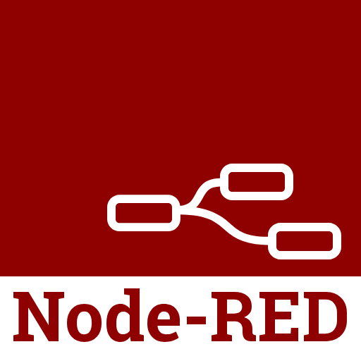

# DeltaV Edge Environment

The DeltaV Edge Environment is a platform that provides easy and secure access to DeltaV system data for on-premise use or in the cloud for monitoring, analytics, reporting or for other Enterprise applications.

### Easy and Secure Access to DeltaV System Data

Accessing plant data from a Distributed Control System such as DeltaV, can be a very complex task. Data resides down in the Control Network and thus bringing it outside to the Enterprise network requires multiple layers of secure processing. The DeltaV Edge Environment simplifies data access to plant data by handling all of the security transfer from across the different network layers.  

### Out-of-the-Box Contextualization that Reflects DeltaV Hierarchy

Extracting control system data often strips away valuable information about relationships between data points – information that exists natively within control system configurations. This loss of embedded context makes it hard to understand how the data relates to the real-world process. DeltaV Edge Environment solves this by replicating DeltaV's configuration hierarchy alongside the data, preserving context and automatically reflecting control system changes – providing an ideal, out-of-the-box contextualization framework.

### Secure Sandbox to Deploy and Run Applications

Data is available on the enterprise-level network, ready for access through widely used interfaces such as OPC UA and REST API.

|   |  |
|------|------|
| 
 [REST API](developer-guide/rest-api/rest-api.md) 
|
 [OPC UA](developer-guide/opc-ua/opc-ua.md) 
| 

These industry standard protocols provides an easy and secure way to access the data and connect to analytical applications and visualizations such as:

|| |  |  |  | 
|---|---|---|----------|----------|
| 
Grafana
 | 
Node-RED
 | 
<a href="https://github.com/EmersonDeltaV/jupyter-labs-for-edge">Jupyter Notebook
 | 
[Power BI](developer-guide/power-bi/power-bi.md)
  | 
[Microsoft Excel](developer-guide/microsoft-excel/microsoft-excel.md)
   |

### Low-touch Maintenance

Software deployment, troubleshooting, updates and upgrades are executed remotely by Emerson, or users can choose to manage these functions themselves.

## Getting Started

To get you started, here are additional info on Edge functionality, sample guides, and repositories:

-	[delta-edge-sdk](https://github.com/EmersonDeltaV/deltav-edge-sdk) -- _C# Edge REST API Client SDK implemented via HttpClient to simplify Edge REST API consumption_

-	[simple-dockerapp-dotnet6](https://github.com/EmersonDeltaV/simple-dockerapp-dotnet6) -- _basic ASP.NET Core 6.0 web app created as a docker image that can be published into the DeltaV Edge Environment_

-	[edge-watch-it](https://github.com/EmersonDeltaV/simple-dockerapp-dotnet6) -- _C# sample app that demonstrates basic Edge functionalities such as User Authentication, connection, and runtime value updates._ 

## Components

DeltaV Edge Environment is a hardware and software solution composed of 4 major components:

|  

| 

 | 

 | 

 |
|---|---|---|---|
|  
[Data Provider](system-components.md#data-provider)
| 
[Edge Node](system-components.md#edge-node)
 | 
[Edge Orchestration](system-components.md#edge-orchestration)
 |
[Data Diode](system-components.md#data-diode-optional)
 |

## Additional Resources 

* [DeltaV Edge Environment Product Page](https://emerson.com/deltavedge)
* [DeltaV Edge Environment Product Data Sheet](https://www.emerson.com/documents/automation/product-data-sheet-deltav-edge-environment-deltav-en-9573950.pdf)
* [DeltaV Edge Environment Solution and Architecture Overview](https://www.youtube.com/watch?v=DKLijP0tvzc)
* [DeltaV Edge Environment System Components](system-components.md)
* [DeltaV Edge Environment Release Info](edge-release-info.md)

## Contributing

This project welcomes contributions, suggestions, and feedback. All contributions, suggestions, and feedback you submit are accepted under the Project's license. You represent that if you do not own copyright in the code that you have the authority to submit it under the Project's license. All feedback, suggestions, or contributions are not confidential.

For more information on how to contribute to DeltaV Edge Environment, please read [CONTRIBUTING.md](CONTRIBUTING.md]).

