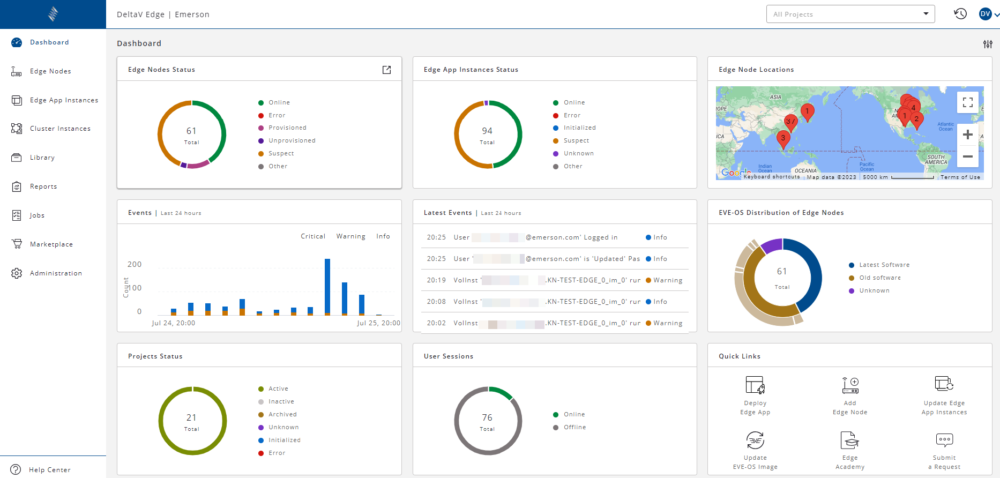
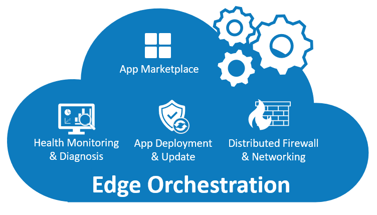

## Edge Orchestration 

As a cloud-based software, the Edge Orchestration capability connects to the Edge Environment operating system and helps users manage their Edge Environments by providing visibility and control to both the software applications running within the Edge Environment and the underlying EVE-OS and computing resources. Edge Orchestration is the Edge Environment’s control panel.

Edge Orchestration can:

-	display Edge Environment’s configuration, status, diagnostics, and resource usage

-	allow users to activate, deactivate, and reboot their DeltaV Edge Environments

-	deploy, diagnose, and update applications

-	configure network setups, update operating systems, and perform system-wide backups. 

The connection between the Edge Environment and Edge Orchestration is based on HTTPS, which is normally open at the enterprise network (Purdue Model Level 4) and the plant network (Purdue Model Level 3). 
The Edge Environments can stay connected with Edge Orchestration so you can monitor the Edge Environment's working status and diagnostics on a constant basis. 

Alternatively, you can connect the Edge Environment to the Edge Orchestration only when needed— the Edge Environment's normal operation does not depend on continuous connection to the Edge Orchestration. 
