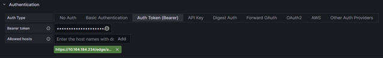
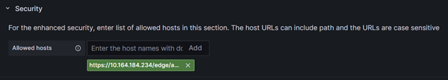
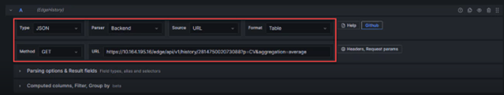

# View and analyze data using Grafana

**Grafana** is a data visualization tool that enables you to view and analyze data.  

Access Grafana using a web browser at `http://{edge_ip}:3000/` where `{edge_ip}` is the IP address of the Edge node Enterprise network (eth0) and 3000 is the designated port for the application.

## Initial Configuration

Follow the steps below to setup dashboards for visualization of system performance:

1.	Access Grafana in a web browser using `http://{edge_ip}:3000/`.

2.	Login with your username and password.

3.	Navigate to Home > Administration > Plugins. 

**Administration Plugins**

 

4.	In the Plugins window, change the Search state to All and search for the Infinity plugin.
5.	Select the plugin and click Install.

**Install Infinity plugin**

6.	After installation, click Create a Infinity data source.

**Create Infinity data source**

7.	Configure the data source with the following settings:
a.	Authentication – Click Bearer token. Generate a bearer token using your REST API endpoint (for example, `https://{edge_ip}/edge/api/v1/Login/GetAuthToken/profile`) and paste it in the bearer token field.

> Note: The bearer token expires, and you may have to renew it periodically.

**Authentication details – Bearer token**
 

b.	Allowed hosts – Add https://{edge_ip}/edge/api/v1 where {edge_ip} is the IP address of the Edge node. Click Add.
c.	TLS/SSL & Network Settings - Enable Skip TLS Verify.

**TLS/SSL & Network Settings**

d.	Security - Check the allowed hosts if the https://{edge_ip}/edge/api/v1 is present. If not, add it.
 
**Security information**

8.	Click Save & test.

## Displaying visualization

You can display data in various visualizations like graphs or diagrams in Grafana. Follow the steps below to view the dashboard.

1.	 Navigate to Home -> Dashboards.

2.	Click the New drop-down list and select New Dashboard.
 
**New Dashboard**

3.	On the dashboard builder, click Add Visualization.

4.	Select the data source from the list.

**Data source options**
 

5.	Configure your Infinity datasource query with the following settings:
 

**Infinity Datasource configuration**

- Type - JSON
- Parser - Backend
- Source - URL
- Format - Table
- Method - GET

- URL – This depends on what endpoint you are trying to get. Examples include:

    - `https:// {edge_ip} /edge/api/v1/graph-hierarchy`
    - `https://eth2/edge/api/v1/history`

- Parsing options and results - Rows/root:
    
    - `$.fieldHistory.fieldValue[*]` for History/cached data

    - `$.p.CV.value` for runtime data

6.	Click the Visualization drop-down and select the visualization type.

**Visualization types**

7.	Once configured, Grafana automatically sends requests and posts them on your panel. 
 
**Sample dashboard**

 

