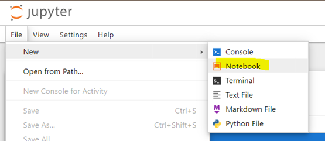
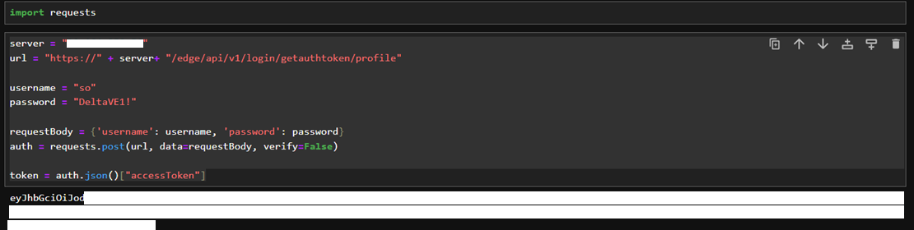
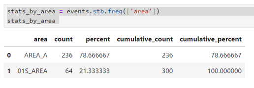

# Introduction

This readme will walk you through how to use the Jupyter Notebooks provided by the Edge Orchestration Marketplace to access your Edge data.

# Prerequisites

1. You must have a Jupyter Notebook installed via the Edge Orchestration Marketplace

# Jupyter Notebook Setup
1.	Launch the Jupyter Notebook Web Interface: http://{edge_ip}:8888. Login to Jupyter using the provided token in Zededa Logs for Jupyter App Instance


Look for the following lines in the Zededa logs for Jupyter app instance:


Then paste it to the login screen:

2.	Click on View -> **Open Jupyter Lab** to install the following pre-requisites:
    * Pandas (for tables)
    * Plotly.Express (for rendering charts)
    * Sidetable (for statistical analysis)
    * Matplotlib (for statistical plots)


3.	Select Terminal:


4.	Run the following command in the Jupyter Lab Terminal to install the pre-requisite components for visualizations:
    * pip install Pandas (for tables) https://pypi.org/project/pandas/ 
    * pip install plotly_express (for charts) https://pypi.org/project/plotly-express/ 
    * pip install sidetable (statistical tables) https://pypi.org/project/sidetable/ 
    * pip install matplotlib (statistical plots) https://pypi.org/project/matplotlib/

##### install pandas


Wait until install success:


##### install plotly-express


Wait until install success


##### install sidetable


Wait until install success


##### install matplotlib


Wait until install success


## Creating new Jupyter Notebook

1. Go back to Jupyter Tree/Explorer:


2. Create new Jupyter Notebook from File ->  Notebook



3.	Insert the following code in the first cell

```console
import requests
import pandas as pd
import plotly.express as px
import sidetable as stb
import matplotlib.pyplot as plt
```

## Generating  User Token

1. Run the following code to obtain and save the authorization token to ‘token’ variable.

```console
server = "{edge_ip}"
url = "https://" + server+ "/edge/api/v1/login/getauthtoken/profile"

username = "so"
password = "{so_password}"

requestBody = {'username': username, 'password': password}
auth = requests.post(url, data=requestBody, verify=False)

token = auth.json()["accessToken"]
```


## Getting Graph Data

1. Create HTTP GET request:

```console
path = "PHSI-PP-14LTS_S/01S_FLOAT6_2/FLT85" // path to be collected
server = "{edge_ip}"
url = 'https://' + server + '/edge/api/v1/graph?path=' + path
headers = {'Authorization': f'Bearer {token}'}
pid = requests.get(url, headers=headers, verify=False) 
pid_response = pid.json()
print (pid_response)
```


2. To display results as table, copy and paste the code below:
```console
pd.DataFrame(pid_reponse['p'])
```


## Getting History Data

1.	Create GET HTTP Request

```console
path = "PHSI-PP-14LTS_S/01S_FLOAT6_2/FLT85" 
server = "{edge_ip}"
url = 'https://' + server + '/edge/api/v1/history?path=' + path + '&p=CV&aggregation=average&interval=100'
headers = {'Authorization': f'Bearer {token}'}
hist = requests.get(url, headers=headers, verify=False) 
hist_response = hist.json()
print (hist_response)
```


2.	Displaying data as table

```console
history = pd.DataFrame(hist_response['fieldHistory']
['fieldValue']) 
history
```


3.	Displaying data as chart
```console
fig_hist = px.line(history.head(500), x='timeStamp', y='value') 
fig_hist.show()
```


## Getting A&E Data

1.	Create HTTP GET Request
```console
server = "{edge_ip}"
url = 'https://' + server + '/edge/api/v1/ae'
print(url)
headers = {'Authorization': f'Bearer {token}'}
ae = requests.get(url, headers=headers, verify=False) 
event_response = ae.json()['alarmsAndEvents']
print(event_response)
```


2.	List Events in Table

```console
events = pd.DataFrame(event_response)
events
```


# Using Jupyter Statistical Tools

1.	Using statistical sidetable: give stats per Area

```console
stats_by_area = events.stb.freq(['area']) 
stats_by_area
```



2.	Plot event stats per Area
```console
fig1, ax1 = plt.subplots() 
ax1.pie(stats_by_area['count'][0:3], labels=stats_by_area['area']
[0:3], autopct='%1.1f%%', startangle=90) 
plt.show()
```


3.	Getting event distribution by Area and by Level (2 Level Statistical Distribution)
```console
stats_by_area_level = events.stb.freq(['area','level']) 
stats_by_area_level
```


4.	Getting Mean and Standard Deviation of History Data

```console
history["value"].mean()
```


```console
history["value"].std()
```


