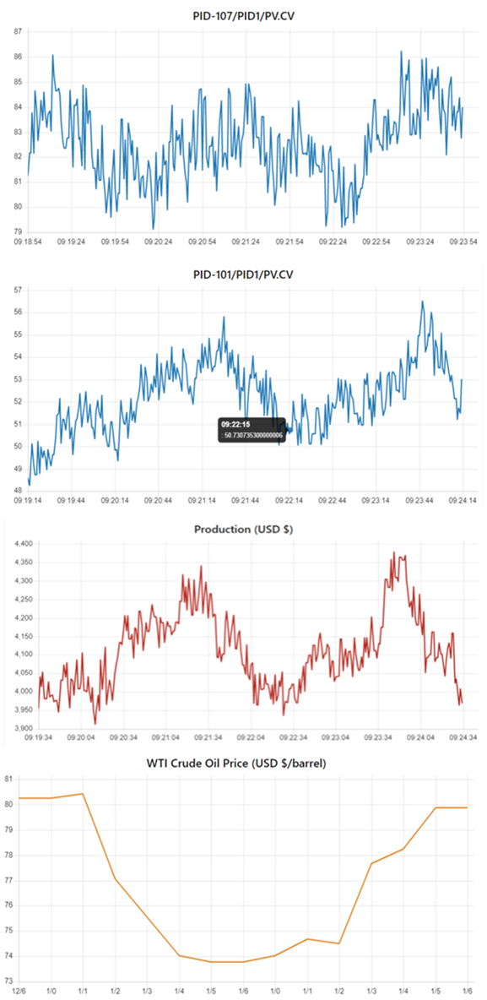

# Display Charts and Trends of Edge Data using Node-RED 

## Initial Configuration

**Node-RED** is a web browser-based flow editor for visual programming and provides a graphical way to wire together different APIs and services, enabling event-driven logic implementations. 
Access Node-RED using a web browser at:

`http://{edge_ip}:1880/` 

where `{edge_ip}` is the IP address of the Edge node Enterprise network (eth0) and 1880 is the designated port for the application.

## Sample Templates for Charts and Trends

The following are templates for charts and trends of the data that are available in the DeltaV Edge Environment:

- Process History View on the Edge

- Edge Processing 

- PID Mode

- Control Module
 

**Process History View replica on the Edge**

**Edge Processing**

Shows runtime data integrated with IT data from the web (for example, livestock market indices, crude oil price, etc.)

 
**PID Mode information**
 

 

**Control Module information**
 

## Sample Codes

1.	Drag and drop the inject node (timestamp), http request node (GET history), function node (Process), and chart node (chart).

2.	Connect all four nodes in series.
 

**Node-RED uses blocks to describe data flow**

. 

3.	Double-click the timestamp node and configure the settings.

**Configure timestamp**

. 

 
4.	Double-click the **GET history** node and configure the settings.  

Set the URL endpoint to: `https://10.223.28.66/api/v1/history?path=DEMO-PROPLUS_S/PID-103/PID1/PV.CV&starttime=2023-01-17T19:00:00&endtime=2023-01-17T19:05:00`

Refer to _Disabling/Skipping SSL verification on HTTP Request_ for steps to disable or skip SSL verification.

**Configure GET history**

 

 
5.	Double-click the **Process** node and configure the settings.

**Configure Process**

. 

 
6.	Double-click the **chart** node and configure the settings.

**Configure Chart**

. 

 
7.	Click **Deploy** to save the changes.

8.	To open the dashboard window, select Dashboard in the drop-down menu.

**Dashboard options**
 
. 

 
9.	Click on the display launcher (square with arrow) icon on the upper-right corner of the page.

**Display output chart by clicking the display launcher**

. 

 
10.	 A new browser tab opens with the display.
 
**Output Chart**

. 

# Node-RED Integration with Edge REST API

Listed below are the steps for installing the prerequisite nodes for data visualization.

1.	Go to **Menu → Manage palette** to install the prerequisite Node-RED dashboard to install the following prerequisite nodes:

-	node-red-dashboard

-	node-red-contrib-moment

- 	node-red-node-ui-table

 
**Manage palette option**

 

	
	
2.	Search for **node-red-dashboard**, **node-red-contrib-moment**, and **node-red-node-ui-table**.
 
**Node-RED nodes**

 

	
3.	Click **Install**.
	

**Install dashboard**

	
4.	Once installed, the dashboard nodes are displayed in the node selection pane.

**Dashboard nodes** 

**Running a Sample Node-Red Dashboard**

1.	On a blank Node-RED flow, click **Menu → Import** to import Node Red_Edge_REST API.json file.
Import file 

2.	On the Imported Node-RED flow, double-click on the following nodes to open the Edit http request node window.
- HISTORY_REQ
- GRAPH_REQ
- AE_REQ

**Imported nodes**

3.	You can edit the request **URL** of the specific DeltaV Edge Environment system you want to get data from, and the Token generated from Postman. Refer to Postman Authentication for more information.

4.	Click **Done**. Refer to _Disabling/Skipping SSL verification on HTTP Request_ for steps to disable or skip SSL verification.

**Update URL and Token**

5.	 After editing all the nodes mentioned, click Deploy.

**Deploy imported Edge node** 

 

 
6.	Launch the Node-RED Dashboard through any of the following:

**Accessing Node-RED dashboard** 

 

 
7.	Click **GET_HIST_DATA** to read and display data from Edge REST API history endpoint

**GET_HIST_DATA from Edge REST API endpoint** 

 

8.	Go to the Edge Alarms and Events page and click **GET_AE_DATA** to get data from Edge REST API A&E endpoint.

**GET_AE_DATA from Edge REST API A&E endpoint** 

 

## Disabling/Skipping SSL verification on HTTP Request

1.	In Node-RED, click **HTTP Request Node** and select **Enable secure (SSL/TLS) connection**.

**Edit HTTP request node**
 
 

 
2.	Click the **Pencil** icon to edit the configuration.

3.	Clear the **Verify server certificate** check box and make sure to click **Update**.

**Verify server certificate**

 

4.	Click **Done**.

**Completing the HTTP request node edit**

 

5.	Click **Deploy**.

**Deploy the HTTP request node edit**

 

