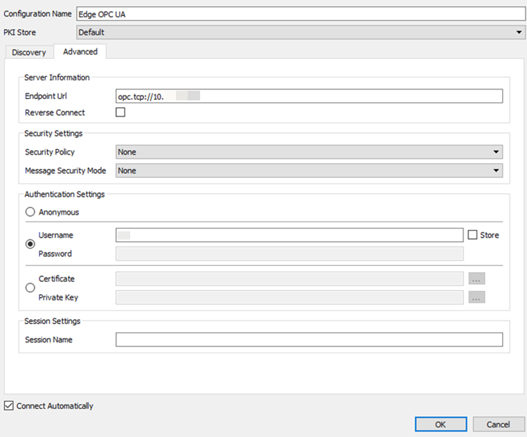
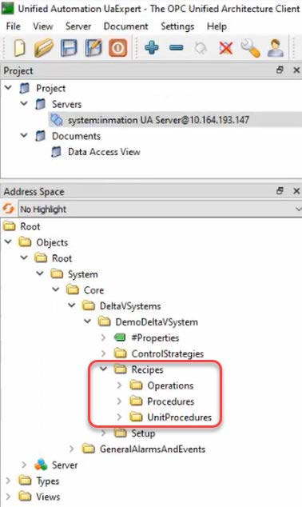
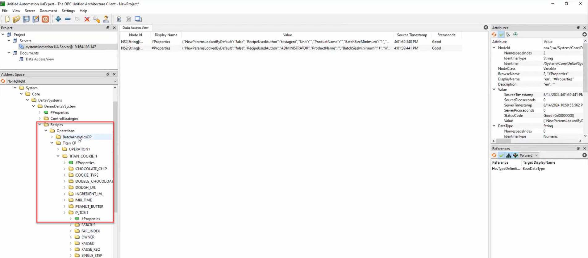
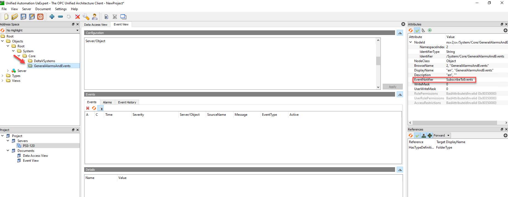
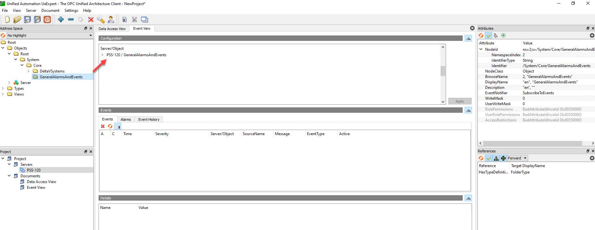
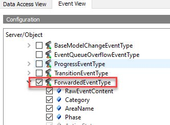
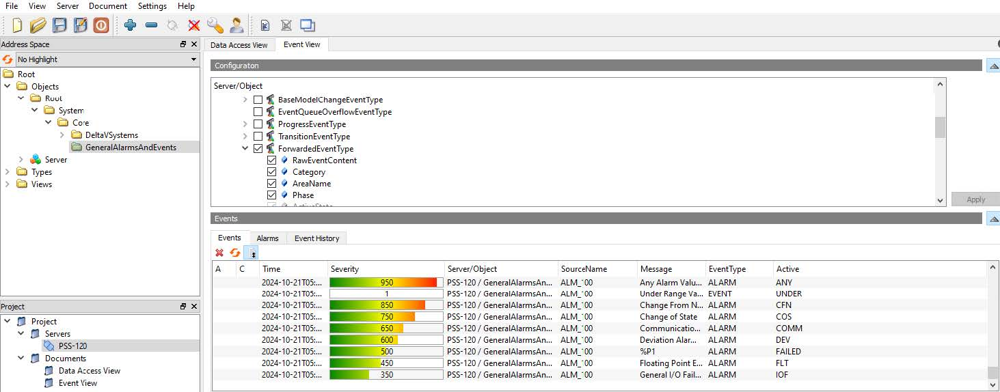
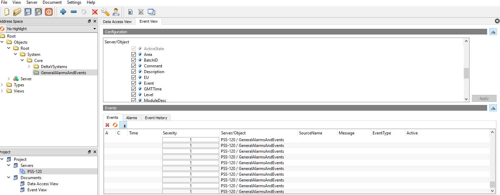
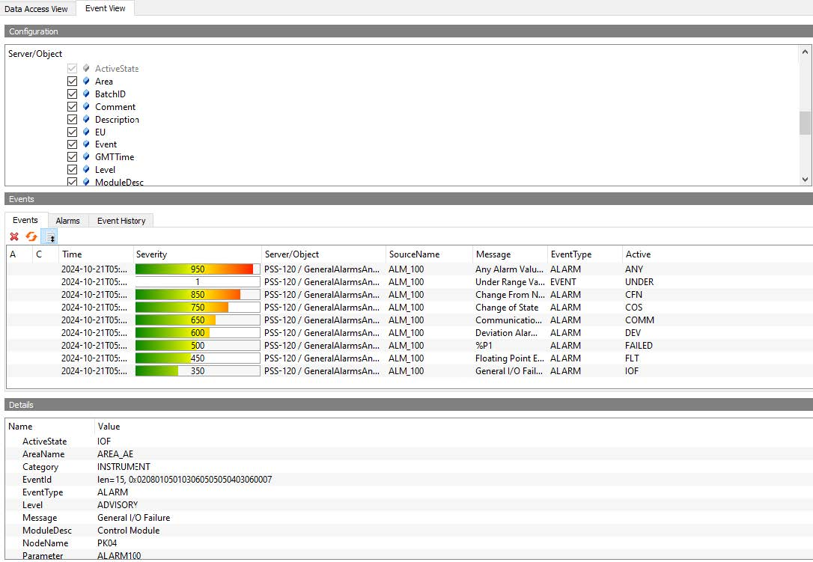
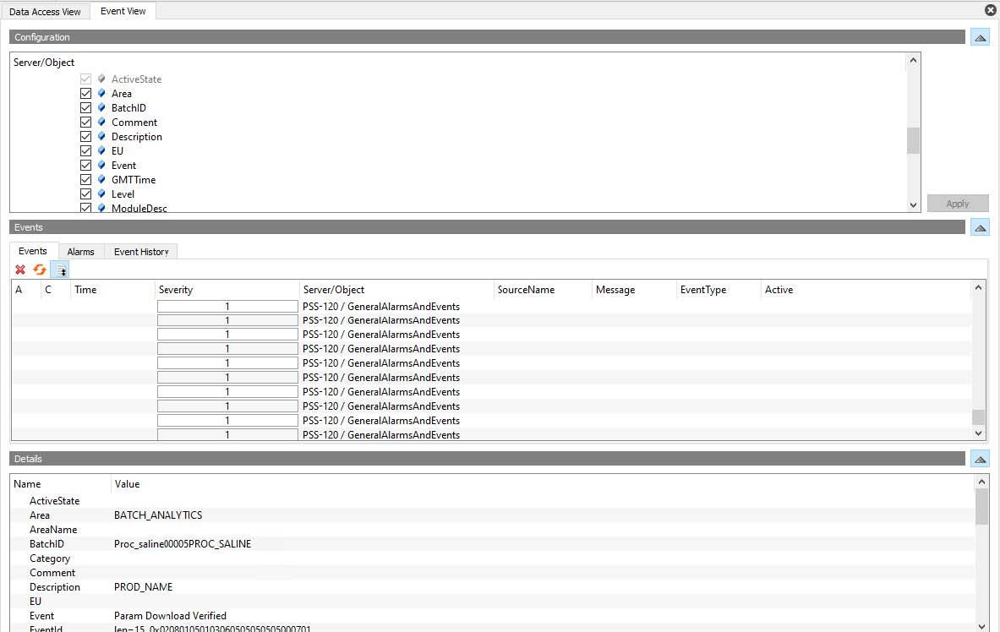

# Access DeltaV Data on the Edge Node using OPC UA

The OPC UA server provides access to DeltaV runtime parameters, alarms and events, and cached data. The OPC UA server also supports multiple aggregation methods to simplify comprehensive data queries. 


You can verify the functionality of the Edge OPC UA server by installing a free OPC UA client (for example, UaExpert, Integration Objects) on a computer with access to the Edge Node.

Use your defined access path and security settings to connect to the Edge OPC UA server.

After a successful connection, you can verify the following information in the OPC UA client:

- Initial connectivity structure

- DeltaV system hierarchy (under Objects folder) and into specific modules and configuration parameters

- Runtime parameters from the History Collection Points or imported CSV file are updating

- History data and multiple aggregation methods

- Alarms and Events

- Batch Events


> **Note**: The complete hierarchy (system to function block) is accessible on the Edge OPC UA but only the subscribed parameters and fields are shown in the Edge OPC UA address space.


# Accessing via UaExpert

## Connect to the Edge OPC UA server

1. Connect the UaExpert OPC UA client application to the Edge OPC UA server 

- **UaExpert** → Add Server → Advanced

> **Note**: Make sure that the OPC UA settings configured here match the settings in: `DeltaV Edge Manager → Settings → OPC UA.`


2. Enter the following details in the Add Server dialog:

a. Server Information

Set Endpoint URL: 
```
opc.tcp://{edge_ip}:XXXX 
```

where ```{edge_ip}``` is the IP address of the Edge Node Enterprise network (eth0)
and ```XXXX``` is the designated port for the OPC UA server.

b. Security Settings - Specify the Security Policy and Message Security Mode
for communications between the Edge OPC UA server and clients.

c. Authentication Settings - Select Username Password and enter the available
and valid login credentials.



```
Note:
- You may select Anonymous for the Authorization Settings but this results in a limited view of the folders in the Address Space.

Make sure to select the Allow Anonymous Client Access check box in:
- DeltaV Edge Manager → Settings → OPC UA.

See Section 2.5 Settings of the DeltaV Edge Environment User Guide for more information.

- The Certificate Private Key logon is not supported in version 1 of the release.
```


3. Click OK.


> Note: Profiles created in the DeltaV Edge Manager can login using their username and password as long as they are set as Available in the Settings menu. Refer to Login Methods for more information.

- If you get a connection error BadCertificateHostNameInvalid, refer to
Mapping the hostname to an IP Address for troubleshooting information.


## Access Control Hierarchy Data

1. On the Project pane, click Edge OPC UA `(Project → Servers → Edge OPC UA)`. The
corresponding Address Space updates accordingly.

2. Browse the system hierarchy on the Address Space `(Root → Objects → Root →
DeltaVSystems → {System name} → ControlStrategies → {List of Areas})`.


```
Note:

- The complete hierarchy (system to function block) is accessible on the Edge OPC UA but only the subscribed parameters and fields are shown in the Edge OPC UA address space.

- The objects displayed in the hierarchy may vary for different profiles. For example, an administrator sees more folders under System than a non-administrator user.
```


## Access Runtime and Cached Parameter Values
The Edge OPC UA supports runtime and history data access. Follow the steps below to
monitor runtime parameter field values and to retrieve cached parameter field values from
the Edge Node using the UaExpert OPC UA client.

1. On the Address Space, navigate to the parameter field that you want to monitor.
For example, to monitor PID-101/PID1/PV.CV, 

```
Root → Objects → Root → System → Core → DeltaVSystems → PH-MS-EDGE-PP_S → ControlStrategies → THERMO_PULPING → PID-101 → PID1 → PV → CV
```

then click on the parameter fields and drag to the Data Access View section.


2. On the Data Access View, you should see the list of monitored parameter fields.
Their values and timestamps change at a rate equal to the configured sampling
periods.

> **Note**: Verify that the values are consistent with those reported in DeltaV WatchIt.

3. On the Project pane, right-click Documents, then click Add History Trend View.


4. Click the History Trend View tab. Drag the parameter field that you want to access history data to the History Trend View.

> **Note**: Verify that the history data are consistent with those reported in DeltaV Process History View.


5. Configure the history trend update settings.

a. For Single Update, enter the trend's Start Time and End Time, then click
Update.


b. For Cyclic Update, enter the trend's Timespan and Update Interval, then
click Start.


## Access Batch Events (UaExpert)
In OPC UA, Recipes are integrated on the Address Space, in the same level with Setup and
Control Strategies, following the structure in DeltaV Explorer together with the properties
of each entity.



Follow the steps below to view the properties of a sample procedure PROC_SALINE in
UaExpert.
1. On the Project pane, click the Edge OPC UA server by navigating to Project →
Servers → {Edge OPC UA server}. The corresponding Address Space updates
accordingly.

2. Browse the Edge hierarchy on the Address Space (Root → Objects → Root →
System → Core → DeltaVSystems → DemoDeltaVSystem → Recipes →
Procedures → PROC_SALINE).
3. Drag #properties to the Data Access View section to display the properties.

You can also view the properties of a sample step P_TCB:1.
1. Browse the Edge hierarchy on the Address Space (Root → Objects → Root →
System → Core → DeltaVSystems → DemoDeltaVSystem → Recipes →
Operations → Titan CP → TITAN_COOKIE_1 → P_TCB:1).
2. Drag #properties to the Data Access View section to display the properties.


## 2.4 Access General Events Data (UaExpert)

You can utilize OPC UA to monitor runtime alarms and events and batch events streamed
to the Edge Node by using the UaExpert OPC UA client.
1. In the Address Space, navigate to the event notifier node configured to receive
events. This node is located at GeneralAlarmsAndEvents (Root → Objects → Root
→ System → Core → GeneralAlarmsAndEvents).

Note
In the Attributes section, click the On/Off icon and ensure that EventNotifier is set
to SubscribeToEvents.
2. Drag the GeneralAlarmsAndEvents node to the configuration panel under the
Event View tab. Wait for 30 to 40 seconds for data to load.


3. Configure the monitored item and select the ForwardedEventType check box from
PSS-120/GeneralAlarmsAndEvents → Simple Events to enable
ForwardedEventType.

4. Click Apply. The system displays all incoming alarms and events as well as batch
events under the Events panel.




5. Click any of the incoming events to view the property details. These properties
include:

- RawEventContent
- Category
- AreaName
- Phase
- ActiveState
- Area
- BatchID
- Comment
- Description
- EU
- Event
- GMTTime
- Level
- ModuleDesc
- NodeName
- PValue
- ParamDesc
- Parameter
- PhaseDesc
- ProcCell
- Recipe
- State
- UniqueID
- Unit
- UnitName
- UserID

> Note
Verify that the alarms and events are consistent with those reported in DeltaV
Process History View or DeltaV Alarms List. For batch events, batch data should be
consistent with the DeltaV Batch Journals.






# Accessing via Integration Objects

In the Integration Objects OPC UA client, you can also monitor runtime values and
aggregated cached parameter field values on the DeltaV Edge Environment.

>  **Note:** 
Aggregation of values is not available in the UaExpert OPC UA client.


## Connect to the Edge OPC UA server

1. Connect the Integration Objects OPC UA client application to the Edge OPC UA server by clicking Connect.

> **Note:** Make sure that the OPC UA settings configured here match the settings in the DeltaV Edge Manager → Settings → OPC UA page.


2. Enter the following details, then click Apply.

    a. On the Server Information group, set Endpoint URL:
```
opc.tcp://{edge_ip} 
```
where ```{edge_ip}``` is the IP address of the Edge Node Enterprise network (eth0).

b. Specify the following communication and security settings:

- Transport Protocol

- Message Encoding

- Security Mode

- Security Policy

c. On the User Authentication Mode group, click UserName, and enter the available and valid login credentials.

d. Click Apply.


```
Note
- You may select Anonymous for the Authorization Settings but this results in a
limited view of the folders in the Address Space. Make sure to select the Allow
Anonymous Client Access check box in the DeltaV Edge Manager → Settings → OPC UA. 

See Section 2.5 Settings of the DeltaV Edge Environment User Guide for more information.

- The Certificate logon is not supported in version 1 of the release.
```

## Access Control Hierarchy Data

1. On the Sessions pane, click Edge OPC UA (Sessions → Edge OPC UA). The corresponding Address Space updates accordingly.

2. Browse the system hierarchy on the Address Space 

```
Root → Objects → Root → System → Core → DeltaVSystems → {System name} → ControlStrategies → {List of Areas}
```


> **Note:** **
The complete hierarchy (system to function block) is accessible on the Edge OPC UA but only the subscribed parameters and fields are shown in the Edge OPC UA address space. 
> - The objects displayed in the hierarchy may vary for different user roles. For
example, an administrator sees more folders under System than a nonadministrator
user.


## Access Runtime and Cached Parameter Values

The Edge OPC UA supports runtime and history data access. Follow the steps below to
monitor runtime parameter field values and to retrieve cached parameter field values from
the Edge Node using the UaExpert OPC UA client.

1. On the Address Space, navigate to the parameter field that you want to monitor.
For example, to monitor PID-101/PID1/PV.CV, Root → Objects → Root → System
→ Core → DeltaVSystems → PH-MS-EDGE-PP_S → ControlStrategies →
THERMO_PULPING → PID-101 → PID1 → PV → CV, then click on the parameter
fields and drag to the Data Access View section.
Figure 2-2: Monitor parameter fields

2. On the Data Access View, you should see the list of monitored parameter fields.
Their values and timestamps change at a rate equal to the configured sampling
periods.

> Note
Verify that the values are consistent with those reported in DeltaV WatchIt.

3. On the Project pane, right-click Documents, then click Add History Trend View.
Figure 2-3: Add History Trend View

4. Click the History Trend View tab. Drag the parameter field that you want to access
history data to the History Trend View.
Note
Verify that the history data are consistent with those reported in DeltaV Process
History View.

Figure 2-4: History Trend View

5. Configure the history trend update settings.

a. For Single Update, enter the trend's Start Time and End Time, then click
Update.

Figure 2-5: History trend Single Update

b. For Cyclic Update, enter the trend's Timespan and Update Interval, then
click Start.

Figure 2-6: History trend Cyclic Update

## 2.3 Access Batch Events (UaExpert)
In OPC UA, Recipes are integrated on the Address Space, in the same level with Setup and
Control Strategies, following the structure in DeltaV Explorer together with the properties
of each entity.

Figure 2-7: Recipe entities in OPC UA (UaExpert)
Follow the steps below to view the properties of a sample procedure PROC_SALINE in
UaExpert.

1. On the Project pane, click the Edge OPC UA server by navigating to Project →
Servers → {Edge OPC UA server}. The corresponding Address Space updates
accordingly.

2. Browse the Edge hierarchy on the Address Space (Root → Objects → Root →
System → Core → DeltaVSystems → DemoDeltaVSystem → Recipes →
Procedures → PROC_SALINE).

3. Drag #properties to the Data Access View section to display the properties.
Figure 2-8: Properties for a selected Recipe entity
You can also view the properties of a sample step P_TCB:1.

1. Browse the Edge hierarchy on the Address Space 

```(Root → Objects → Root → System → Core → DeltaVSystems → DemoDeltaVSystem → Recipes → Operations → Titan CP → TITAN_COOKIE_1 → P_TCB:1).```

2. Drag #properties to the Data Access View section to display the properties.
Figure 2-9: Properties for a selected step

## 2.4 Access General Events Data (UaExpert)

You can utilize OPC UA to monitor runtime alarms and events and batch events streamed
to the Edge Node by using the UaExpert OPC UA client.

1. In the Address Space, navigate to the event notifier node configured to receive
events. This node is located at GeneralAlarmsAndEvents 

```(Root → Objects → Root → System → Core → GeneralAlarmsAndEvents).```

Figure 2-10: GeneralAlarmsAndEvents in the Address Space

> **Note:**

In the Attributes section, click the On/Off icon and ensure that EventNotifier is set
to SubscribeToEvents.

2. Drag the GeneralAlarmsAndEvents node to the configuration panel under the
Event View tab. Wait for 30 to 40 seconds for data to load.

Figure 2-11: GeneralAlarmsAndEvents (Event View)

3. Configure the monitored item and select the ForwardedEventType check box from
PSS-120/GeneralAlarmsAndEvents → Simple Events to enable
ForwardedEventType.

Figure 2-12: Enable ForwardedEventType

4. Click Apply. The system displays all incoming alarms and events as well as batch
events under the Events panel.

Figure 2-13: Incoming alarms and events list

Figure 2-14: Incoming batch events list

5. Click any of the incoming events to view the property details. These properties
include:

-  RawEventContent
-  Category
-  AreaName
-  Phase
-  ActiveState
-  Area
-  BatchID
-  Comment

Access DeltaV Data on the Edge Node using OPC UA
-  Description
-  EU
-  Event
-  GMTTime
-  Level
-  ModuleDesc
-  NodeName
-  PValue
-  ParamDesc
-  Parameter
-  PhaseDesc
-  ProcCell
-  Recipe
-  State
-  UniqueID
-  Unit
-  UnitName
-  UserID

> **Note:**

Verify that the alarms and events are consistent with those reported in DeltaV
Process History View or DeltaV Alarms List. For batch events, batch data should be
consistent with the DeltaV Batch Journals.

Figure 2-15: Alarms and event details

Figure 2-16: Batch events details

# 2.5 Connect to the Edge OPC UA server (Integration Objects)


In the Integration Objects OPC UA client, you can also monitor runtime values and
aggregated cached parameter field values on the DeltaV Edge Environment.

> **Note:**

Aggregation of values is not available in the UaExpert OPC UA client.

1. Connect the Integration Objects OPC UA client application to the Edge OPC UA
server by clicking Connect.
Note
Make sure that the OPC UA settings configured here match the settings in the

```DeltaV Edge Manager → Settings → OPC UA Security page.```

2. Enter the following details, then click Apply.
a. On the Server Information group, set Endpoint URL: opc.tcp://
{edge_ip} where {edge_ip} is the IP address of the Edge Node Enterprise
network (eth0).
Access DeltaV Data on the Edge Node using OPC UA
D800168X012 December 2024
65
b. Specify the following communication and security settings:
-  Transport Protocol
-  Message Encoding
-  Security Mode
-  Security Policy

c. On the User Authentication Mode group, click UserName, and enter the
available and valid login credentials.

d. Click Apply.

Figure 2-17: Integration Objects OPC UA client

> **Note:**
-  You may select Anonymous for the Authorization Settings but this results in a
limited view of the folders in the Address Space. Make sure to select the Allow

Anonymous Login check box in the DeltaV Edge Manager → Settings → OPC
UA Security.
-  The Certificate logon is not supported in version 2.0 of the release.

## 2.6 Access Control Hierarchy Data (Integration Objects)
1. On the Sessions pane, click Edge OPC UA (Sessions → Edge OPC UA). The
corresponding Address Space updates accordingly.

2. Browse the system hierarchy on the Address Space (Root → Objects → Root →
System → Core → DeltaVSystems → {System name} → ControlStrategies → {List
of Areas})
Figure 2-18: Integration Objects OPC UA Client Address Space
> **Note:**
The complete hierarchy (system to function block) is accessible on the Edge OPC UA
but only the subscribed parameters and fields are shown in the Edge OPC UA
address space.


## 2.7 Access Runtime and Cached Parameter Values - Aggregate (Integration Objects)

1. On the Address Space, navigate to the parameter field that you want to monitor.
For example, to monitor PID-101/PID1/PV.CV, Root → Objects → Root → System
→ Core → DeltaVSystems → PH-MS-EDGE-PP_S → ControlStrategies →
THERMO_PULPING → PID-101 → PID1 → PV → CV, then right-click Monitor.
Figure 2-19: Monitor parameter fields

2. Fill in the Subscription Settings, then click OK.

3. On the Data View tab, you should see the list of monitored parameter fields. Their
values and timestamps change at a rate equal to the configured sampling periods.
Figure 2-20: List of monitored parameter fields (Data View)

4. Click the History View tab. Drag the parameter field that you want to access history
data.

5. To get raw parameter field values, select Read Type = Raw, then set the timespan
of the data via the Start Time and End Time.

Figure 2-21: List of monitored parameter fields with Read Type = Raw (History View)

6. To get aggregated parameter field values, set Read Type = Processed, select from
the list of Aggregate functions the function you want to apply (for example,
Average) over data values within set Processing Interval, then set the timespan of
data you want to retrieve via the Start Time and End Time.

Figure 2-22: List of monitored parameter fields with Read Type = Processed (History View)


________________________________

## Access Runtime and Cached Parameter Values -Aggregate

In the Integration Objects OPC UA client, you can also monitor runtime values and aggregated cached parameter field values on the DeltaV Edge Environment.

> **Note:** Aggregation of values is not available in the UaExpert OPC UA client.


1. On the Address Space, navigate to the parameter field that you want to monitor.
For example, to monitor PID-101/PID1/PV.CV:
```
Root → Objects → Root → System → Core → DeltaVSystems → PH-MS-EDGE-PP_S → ControlStrategies → THERMO_PULPING → PID-101 → PID1 → PV → CV
```
, then right-click Monitor.


2. Fill in the Subscription Settings, then click OK.

3. On the Data View tab, you should see the list of monitored parameter fields. Their values and timestamps change at a rate equal to the configured sampling periods.


4. Click the History View tab. Drag the parameter field that you want to access history
data.

5. To get raw parameter field values, select Read Type = Raw, then set the timespan
of the data via the Start Time and End Time.


6. To get aggregated parameter field values, set Read Type = Processed, select from the list of Aggregate functions the function you want to apply (for example,Average) over data values within set Processing Interval, then set the timespan of data you want to retrieve via the Start Time and End Time.


> **Note:** All the aggregate functions on the drop-down list are supported by the Edge OPC UA server.
