# How to connect REST API endpoint to Power BI

Step by step instructions for connecting Power BI to the DeltaV Edge REST API. This guide uses query parameters so values like the bearer token, Edge node address, and date ranges are managed in one place. Works in both Power BI Desktop and Power BI Report Server.

## 1. Download and Install the Rest API Certificate

The DeltaV Edge REST API uses HTTPS with a self-signed certificate. Power BI will refuse to connect until that certificate is trusted on the machine running Power BI.

1. If you already have the certificate, skip ahead to sub-step 7 below.
2. Open the DeltaV Edge Manager portal in a browser.
3. Navigate to the **Certificates** section.

    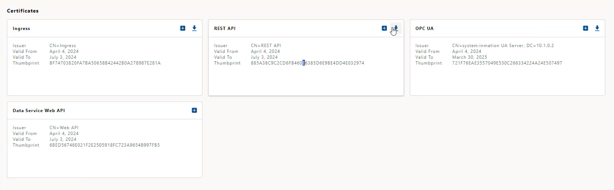<p>

4. Click **Generate the Rest API Certificate**.

    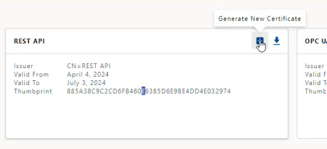<p>

5. Click **Download** to save the certificate file to your machine. It will be in DER format.
6. Locate the downloaded `.cer` file.
7. Double-click the certificate file. The Certificate dialog opens.
8. Click **Install Certificate**. The Certificate Import Wizard opens.
9. For **Store Location**, choose **Local Machine** (recommended) or **Current User**. Local Machine applies to every user on the computer; Current User is just for you. Click **Next**.
10. Select **Place all certificates in the following store**, click **Browse**, choose **Trusted Root Certification Authorities**, then click **OK** and **Next**.
11. Click **Finish**. You should see a confirmation that the import was successful.

    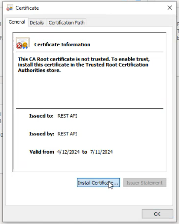<p>

12. **For Power BI Report Server deployments**: repeat sub-steps 7 through 11 on the Power BI Report Server machine as well. Scheduled refresh runs on that machine, so the cert must be trusted there too.

## 2. Obtain the Bearer Token

The bearer token is what authenticates your API calls. You generate it once using your Edge user credentials, then store it in Power BI.

1. Open Postman (or any REST client of your choice).
2. Click **New** then **HTTP Request** to create a new request tab.
3. Click the method dropdown (default is GET) and select **POST**.
4. In the URL field, enter: `https://{edge ip}/edge/api/v1/Login/GetAuthToken/profile`
    - Replace `{edge ip}` with the actual IP address of your Edge Node.
    - If you authenticate with an Active Directory account instead of a local Edge user, use this URL instead: `https://{edge ip}/edge/api/v1/Login/GetAuthToken/activedirectory`
5. Click the **Body** tab below the URL field.
6. Select the **form-data** radio button.
7. Add two rows in the form-data table:
    - First row: Key = `username`, Value = your Edge user's username
    - Second row: Key = `password`, Value = your Edge user's password
8. Click the blue **Send** button.
9. The response panel at the bottom shows the result. You should see HTTP status `200 OK` and a JSON body like:

    ```json
    {
       "accessToken": "abcdefg...",
       "result": 1
    }
    ```

    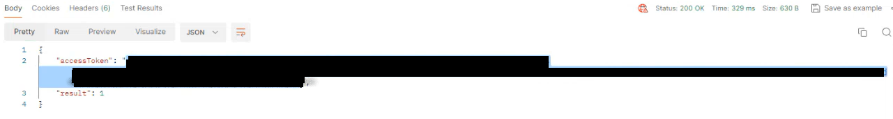<p>

10. Copy the value of `accessToken` only. Do not include the surrounding double quotes, do not include the word "bearer", and do not include the rest of the JSON.

> Note: The default token validity is 1 day. You can configure it up to a maximum of 30 days in the DeltaV Edge Manager. See the "Rotating the Bearer Token" section below for how to refresh it on a running report.

## 3. Open Power BI Desktop and Power Query Editor

1. Open Power BI Desktop.

    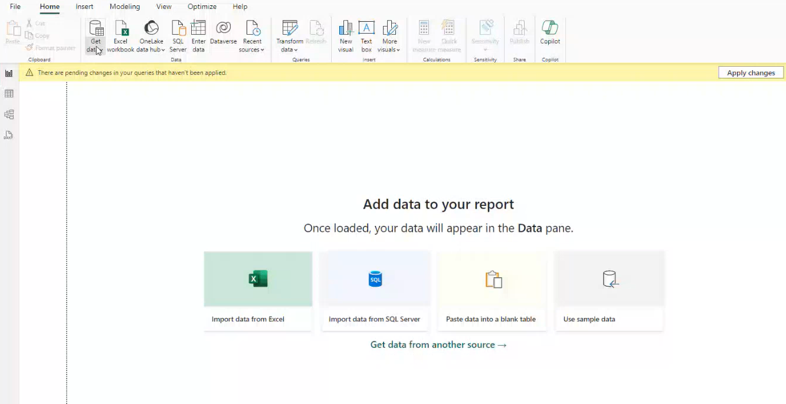<p>

2. If a splash screen appears, close it or click **Blank report**. You should see the main Power BI window with an empty canvas.
3. On the top ribbon, make sure you are on the **Home** tab.
4. Click **Transform data**. A new window called **Power Query Editor** opens. This is where you build and shape queries.

    <!-- NEW IMAGE: Power BI Home ribbon with the Transform data button highlighted -->
    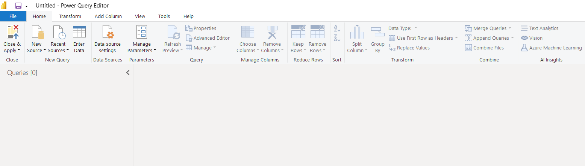<p>

## 4. Create the Parameters

Parameters let you store key values in one location so every query shares them. This guide creates a full set of parameters that covers the common needs: authentication, environment switching, pagination, path-based queries, and incremental refresh.

You can skip any parameter you do not need (for example, skip `RangeStart` and `RangeEnd` if you are not using incremental refresh), but creating them all upfront makes future queries easier to build.

### Parameter 1: EdgeIP

This holds the IP address of your DeltaV Edge Node, so you can switch between dev and production by editing one value.

1. In the Power Query Editor window, on the **Home** tab, click the **Manage Parameters** dropdown.
2. Click **New Parameter** from the dropdown menu.

    <!-- NEW IMAGE: the Manage Parameters dropdown menu open showing "New Parameter" -->
    <p>

3. Fill in the fields:
    - **Name**: `EdgeIP`
    - **Description**: `DeltaV Edge Node IP address`
    - **Required**: checked
    - **Type**: `Text`
    - **Current Value**: your Edge Node IP, for example `10.166.58.11` (no protocol, no path)

    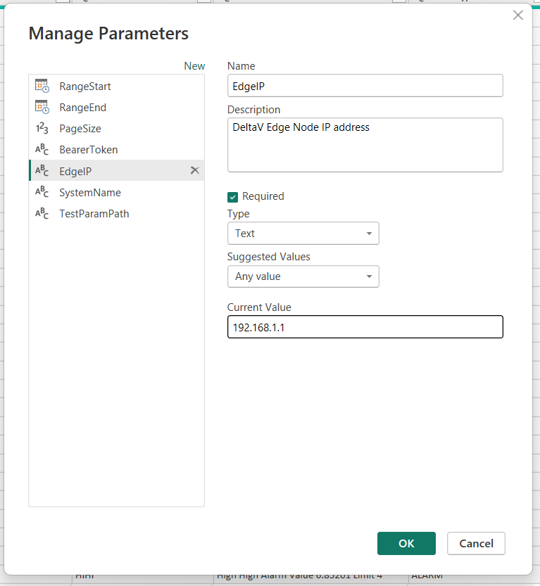<p>

4. Click **OK**.

### Parameter 2: BearerToken

The bearer token from Step 2. Stored separately so you can rotate it without touching any queries.

1. Click the **Manage Parameters** dropdown again, then **New Parameter**.
2. Fill in the fields:
    - **Name**: `BearerToken`
    - **Description**: `DeltaV Edge REST API bearer token`
    - **Required**: checked
    - **Type**: `Text`
    - **Current Value**: paste the `accessToken` from Step 2.10

    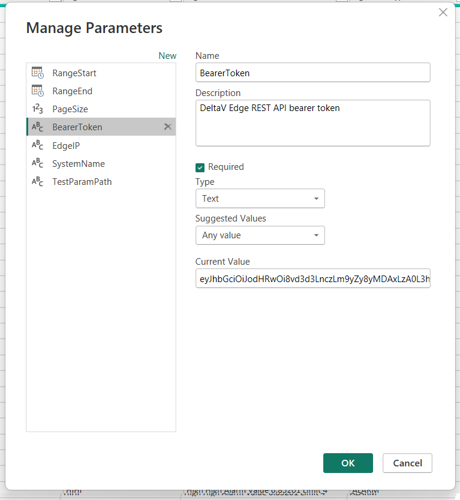<p>

3. Click **OK**.

### Parameter 3: SystemName

The name of your DeltaV system, used in path-based queries against the `/graph` and `/history` endpoints.

1. Click **Manage Parameters > New Parameter**.
2. Fill in the fields:
    - **Name**: `SystemName`
    - **Description**: `DeltaV system name as used in path-based REST API queries`
    - **Required**: checked
    - **Type**: `Text`
    - **Current Value**: your DeltaV system name, for example `DV-LIVE-EDGE-PP_S`

    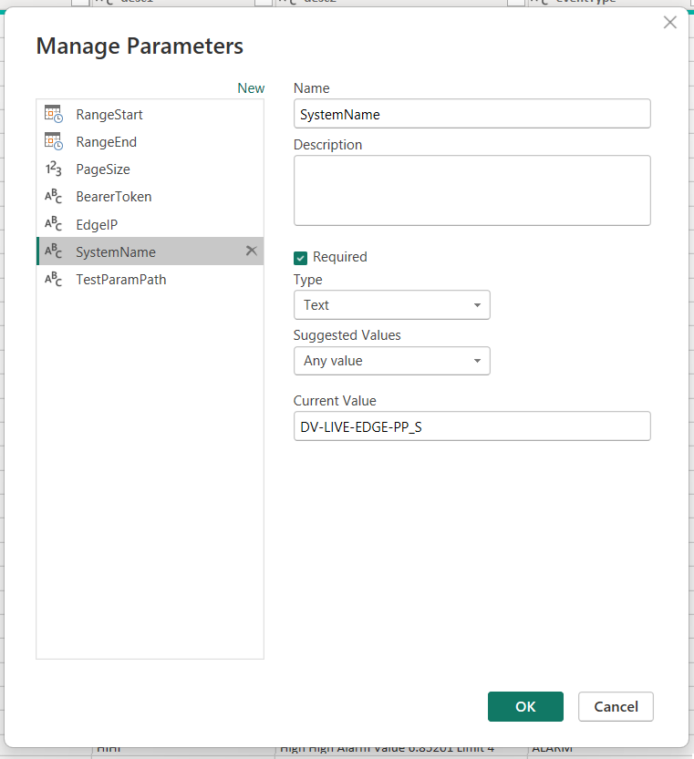<p>

3. Click **OK**.

### Parameter 4: PageSize

The page size used when paginating through alarm, event, and batch event records. The DeltaV Edge default is 300 records per page; you can increase this up to about 10,000 for faster bulk pulls.

1. Click **Manage Parameters > New Parameter**.
2. Fill in the fields:
    - **Name**: `PageSize`
    - **Description**: `Page size for paginated REST API endpoints like /ae and /batchevent`
    - **Required**: checked
    - **Type**: `Decimal Number`
    - **Current Value**: `300`

    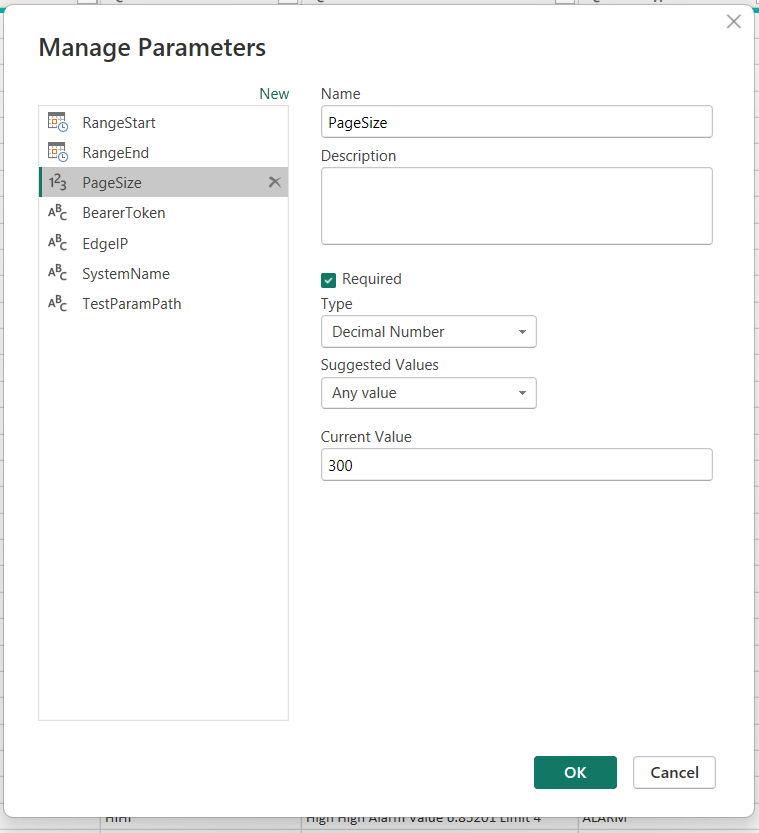<p>

3. Click **OK**.

### Parameter 5 and 6: RangeStart and RangeEnd

These are special parameters that Power BI's Incremental Refresh feature requires. The names must be **exactly** `RangeStart` and `RangeEnd`, and the type must be **Date/Time**. Create them now even if you do not need incremental refresh yet; they cost nothing and unlock the feature later.

1. Click **Manage Parameters > New Parameter**. Fill in:
    - **Name**: `RangeStart`
    - **Required**: checked
    - **Type**: `Date/Time`
    - **Current Value**: a date in the past, for example `10/1/2025 12:00:00 AM`

    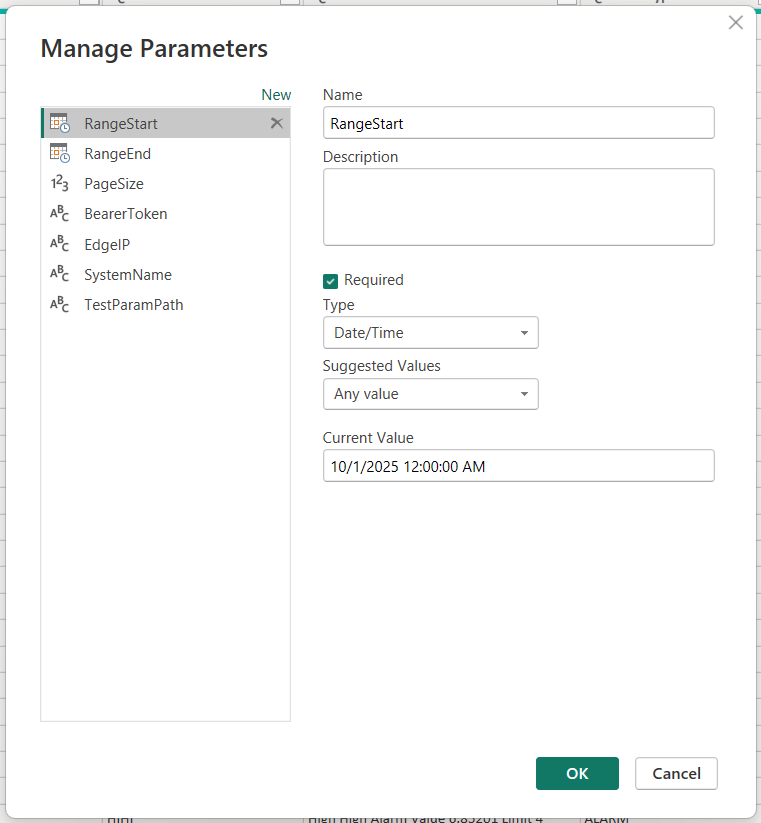<p>

2. Click **OK**.
3. Click **Manage Parameters > New Parameter** again. Fill in:
    - **Name**: `RangeEnd`
    - **Required**: checked
    - **Type**: `Date/Time`
    - **Current Value**: a date in the future, for example `12/31/2026 12:00:00 AM`

    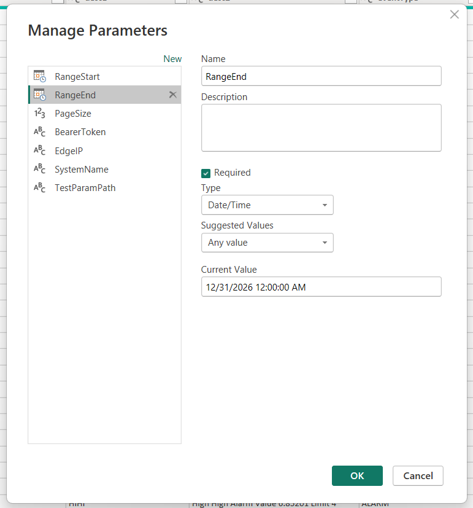<p>

4. Click **OK**.

All six parameters now appear in the **Queries** pane on the left.

## 5. Create the Query Using Parameters

Instead of using **Home > Get Data > Web** (which bakes the token into a single query's header value), use a Blank Query so you can write the M code directly. This gives you control over headers and lets you reference parameters cleanly.

1. Still in Power Query Editor, on the **Home** tab, click the **New Source** dropdown.
2. Click **Blank Query** at the bottom of the menu (you may need to click **More** or **Other Sources** first depending on the Power BI version).

    <!-- NEW IMAGE: the New Source dropdown with Blank Query highlighted -->
    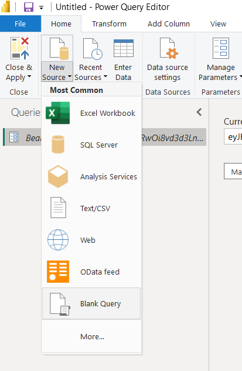<p>

3. A new query called `Query1` appears in the Queries pane on the left and is selected.
4. On the **Home** tab, click **Advanced Editor**.

    <!-- NEW IMAGE: the Advanced Editor button on the Home ribbon -->
    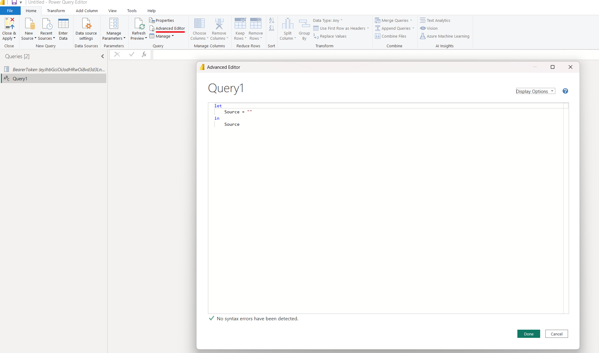<p>

5. The Advanced Editor window opens with the default M code.
6. Select all the existing code and delete it.
7. Here is sample M code you paste to pull Alarms and Events data:

    ```m
    let
        Source = Json.Document(
            Web.Contents(
                "https://" & EdgeIP,
                [
                    RelativePath = "edge/api/v2/ae",
                    Query = [
                        PS = Text.From(PageSize)
                    ],
                    Headers = [
                        Authorization = "Bearer " & BearerToken,
                        #"Content-Type" = "application/json"
                    ]
                ]
            )
        )
    in
        Source
    ```

8. Notice that `EdgeIP`, `PageSize`, and `BearerToken` are referenced by name. They pull from the parameters you created in Step 4.

    > Note: parameterizing the base URL can trigger a "dynamic data source" warning when refreshing on Power BI Service or Report Server. The fix is a one time data source settings adjustment after publishing; see the Common Issues section below. The convenience of switching between Edge nodes via a parameter is usually worth it.

    <!-- NEW IMAGE: the Advanced Editor with the M code pasted in -->
    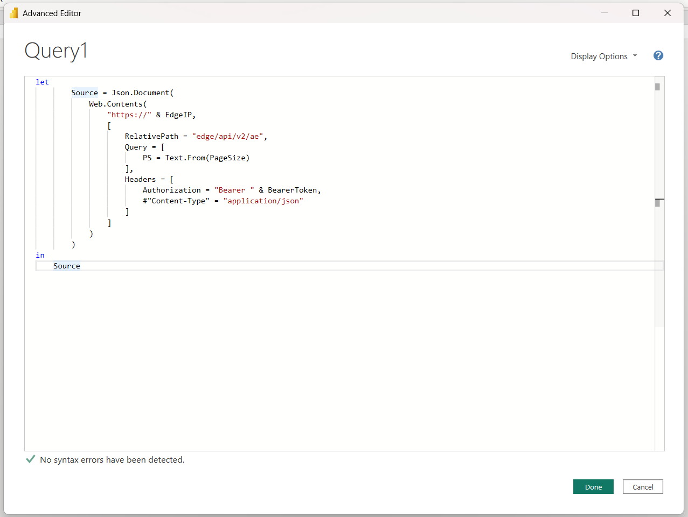<p>

9. At the bottom left of the Advanced Editor, confirm you see "No syntax errors have been detected." Click **Done**.

## 6. Handle the Credentials Prompt

The first time Power Query runs a query against a new URL, it asks how to authenticate.

1. A yellow bar may appear at the top of the preview area saying "Please specify how to connect." Click **Edit Credentials**. (If a dialog opens automatically, skip this step.)
2. The **Access Web content** dialog opens. In the left sidebar, click **Anonymous**.
3. At the top of the dialog, there is a dropdown labeled "Select which level to apply these settings to." Choose the URL that matches your Edge IP, for example `https://10.166.58.11`. This applies the anonymous credential to all endpoints under that base URL.
4. Click **Connect**.

> Why Anonymous? Because the actual authentication is handled by the bearer token in the `Authorization` header. Power BI does not need its own credential. Choosing any other option here will conflict with the header auth.

## 7. Shape the Response into a Table

The query returns the JSON response from the Edge REST API. JSON from the Edge endpoints comes back as records or lists, which you need to convert to a table to use in your report.

The example below assumes you called `/edge/api/v2/ae` (alarms and events).

1. The preview area shows a Record with fields like `alarmsAndEvents` and `paging`.
2. Click the green word **List** next to `alarmsAndEvents`. This drills you into the list of alarm records.
3. The view changes to show a numbered list of records. On the ribbon, a contextual **List Tools > Transform** tab appears.
4. Click **To Table** on the ribbon. A small dialog opens.
5. Leave the defaults (no delimiter, ignore extra values) and click **OK**.
6. You now have a single column called `Column1` containing records. Each row is one alarm.
7. Click the small **expand icon** (two arrows pointing outward) at the top right of the `Column1` header.
8. A dropdown shows all the available fields. Uncheck **Use original column name as prefix** at the bottom, then click **OK**.
9. The columns expand into your table: `timeSent`, `area`, `category`, `desc1`, `desc2`, `eventType`, `level`, `module`, `moduleDescription`, `node`, `parameter`, `state`, `unit`, `timeOfOccurrence`, `timeOfLastChange`, `priority`, and so on.
10. For each column, set the correct data type by clicking the small data type icon (ABC, 123, calendar, etc.) on the left side of each column header:
    - DateTime columns (`timeSent`, `timeOfOccurrence`, `timeOfLastChange`): set to **Date/Time**
    - Numeric columns (`priority`): set to **Whole Number**
    - All other text columns: leave as **Text**
11. In the Queries pane on the left, right click `Query1` and choose **Rename**. Give it a descriptive name like `AlarmEvents`.

### Common response shapes for other endpoints

- `/edge/api/v1/batchevent`: returns `batchEvents` (list). Same flow: drill into the list, To Table, expand.
- `/edge/api/v1/history`: returns a record with `entityId`, `properties`, and `fieldHistory`. Drill into `fieldHistory > fieldValue` (list), then To Table, then expand `timeStamp` and `value`.
- `/edge/api/v1/graph` (root): returns a record like `{ "deltaV": { "systems": [...] } }`. Drill into `deltaV > systems` to get a list, then To Table.

## 8. Load the Data into the Model

1. On the Power Query Editor ribbon, click **Home > Close & Apply**.
2. Power Query Editor closes. Back in Power BI Desktop, you see the data loading.
3. When loading completes, the query appears in the **Data** pane on the right.
4. You can now drag fields onto the canvas to build visuals.
5. Save the report: **File > Save** (or **Save As**). Choose a name and location for your `.pbix` file.

## 9. Adding Time Range Filters

Most production queries need a time range filter. Use `RangeStart` and `RangeEnd` so the same query works for both manual refresh and incremental refresh (Step 12).

The DeltaV Edge API expects ISO 8601 datetimes in UTC, ideally with 7-digit fractional seconds and a `Z` suffix. The cleanest way to produce that format in M is `DateTimeZone.ToText` combined with `DateTime.AddZone`:

```m
let
    StartTimeText =
        DateTimeZone.ToText(
            DateTime.AddZone(DateTime.From(RangeStart), 0),
            "yyyy-MM-ddTHH:mm:ss.fffffffZ"
        ),
    EndTimeText =
        DateTimeZone.ToText(
            DateTime.AddZone(DateTime.From(RangeEnd), 0),
            "yyyy-MM-ddTHH:mm:ss.fffffffZ"
        ),
    Source = Json.Document(
        Web.Contents(
            "https://" & EdgeIP,
            [
                RelativePath = "edge/api/v2/ae",
                Query = [
                    StartTime = StartTimeText,
                    EndTime = EndTimeText,
                    PS = Text.From(PageSize),
                    level = "CRITICAL"
                ],
                Headers = [
                    Authorization = "Bearer " & BearerToken
                ]
            ]
        )
    )
in
    Source
```

`DateTime.AddZone(..., 0)` forces UTC. `fffffff` gives 7-digit precision (100-nanosecond ticks), which matches what DeltaV uses internally.

To edit an existing query: in Power Query Editor, select the query in the Queries pane, click **Advanced Editor** on the Home tab, modify the code, click **Done**.

## 10. Connecting to Other Endpoints

The same pattern works for any DeltaV Edge endpoint. Create a new Blank Query for each one (Step 5), paste the M code with the right `RelativePath`:

- Configuration hierarchy: `edge/api/v1/graph`
- Runtime and cached parameter values: `edge/api/v1/history`
- Alarms and events: `edge/api/v2/ae` (or `edge/api/v1/ae`)
- Batch events: `edge/api/v1/batchevent`
- Bulk endpoints: `edge/api/v1/bulk/graph`, `edge/api/v1/bulk/runtime`, `edge/api/v1/bulk/history`

### Path-based query example using SystemName

For endpoints that use the path syntax (like `/graph` and `/history`), use `SystemName` to build the path:

```m
let
    Source = Json.Document(
        Web.Contents(
            "https://" & EdgeIP,
            [
                RelativePath = "edge/api/v1/graph",
                Query = [
                    path = SystemName & "/PID-101/PID1/PV",
                    p = "CV"
                ],
                Headers = [
                    Authorization = "Bearer " & BearerToken
                ]
            ]
        )
    )
in
    Source
```

Changing `SystemName` (in the Manage Parameters dialog or on the Report Server portal) instantly retargets every path-based query to a different DeltaV system.

## 11. Production Pattern: Paginated Alarm Pull

A single REST API call returns at most `PageSize` records. For any meaningful time range, you will hit that ceiling and need to paginate through multiple pages. This is why `PageSize` exists as a parameter: it lets you tune the page size without rewriting queries, and you wrap it in a pagination loop.

The example below is the full production pattern for pulling alarms. It uses every parameter, handles pagination automatically via `List.Generate`, applies bulk type conversion, and adds derived analytical columns. You can adapt it for batch events, history, or any other paginated endpoint.

```m
let
    // =========================
    // Base config (uses your parameters)
    // =========================
    BaseUrl  = "https://" & EdgeIP,
    Path     = "edge/api/v2/ae",
    PS       = PageSize,

    // =========================
    // Time window from your parameters
    // Format: yyyy-MM-ddTHH:mm:ss.fffffffZ (UTC)
    // =========================
    StartTimeText =
        DateTimeZone.ToText(
            DateTime.AddZone(DateTime.From(RangeStart), 0),
            "yyyy-MM-ddTHH:mm:ss.fffffffZ"
        ),
    EndTimeText =
        DateTimeZone.ToText(
            DateTime.AddZone(DateTime.From(RangeEnd), 0),
            "yyyy-MM-ddTHH:mm:ss.fffffffZ"
        ),

    // =========================
    // Function: get one page
    // =========================
    GetPage = (PageNum as number) as record =>
        Json.Document(
            Web.Contents(
                BaseUrl,
                [
                    RelativePath = Path,
                    Headers = [
                        Accept = "application/json",
                        Authorization = "Bearer " & BearerToken
                    ],
                    Query = [
                        StartTime = StartTimeText,
                        EndTime   = EndTimeText,
                        PS        = Text.From(PS),
                        PN        = Text.From(PageNum),
                        eventType = "ALARM"
                    ]
                ]
            )
        ),

    // =========================
    // Pull all pages for the window
    // Stops when a page returns 0 events
    // =========================
    Pages =
        List.Generate(
            () => [pn = 1, resp = GetPage(1)],
            each List.Count( try [resp][alarmsAndEvents] otherwise {} ) > 0,
            each [pn = [pn] + 1, resp = GetPage([pn] + 1)],
            each (try [resp][alarmsAndEvents] otherwise {})
        ),
    AllEvents = List.Combine(Pages),

    // =========================
    // Convert to table + expand fields
    // =========================
    T = Table.FromList(AllEvents, Splitter.SplitByNothing(), null, null, ExtraValues.Error),
    Expanded =
        Table.ExpandRecordColumn(
            T,
            "Column1",
            {
                "timeSent","area","category","desc1","desc2",
                "eventType","level","module","moduleDescription",
                "node","parameter","state","unit",
                "timeOfOccurrence","timeOfLastChange","priority"
            }
        ),

    // =========================
    // Data types
    // =========================
    #"Changed Type" =
        Table.TransformColumnTypes(
            Expanded,
            {
                {"timeSent", type datetime},
                {"timeOfOccurrence", type datetime},
                {"timeOfLastChange", type datetime},
                {"priority", Int64.Type},
                {"area", type text},
                {"category", type text},
                {"desc1", type text},
                {"desc2", type text},
                {"eventType", type text},
                {"level", type text},
                {"module", type text},
                {"moduleDescription", type text},
                {"node", type text},
                {"parameter", type text},
                {"state", type text},
                {"unit", type text}
            }
        ),

    // =========================
    // Add AlarmOccurrenceKey (area, unit, module, parameter, desc1, timeOfOccurrence)
    // =========================
    #"Added AlarmKey" =
        Table.AddColumn(#"Changed Type", "AlarmOccurrenceKey", each Text.Combine(
                    {
                        Text.From(Record.FieldOrDefault(_, "area", "")),
                        Text.From(Record.FieldOrDefault(_, "unit", "")),
                        Text.From(Record.FieldOrDefault(_, "module", "")),
                        Text.From(Record.FieldOrDefault(_, "parameter", "")),
                        Text.From(Record.FieldOrDefault(_, "desc1", "")),
                        if Record.FieldOrDefault(_, "timeOfOccurrence", null) <> null
                        then DateTime.ToText([timeOfOccurrence], "yyyy-MM-ddTHH:mm:ss")
                        else ""
                    },
                    "|"
                ), type text),

    // =========================
    // Add AlarmDefinitionKey (area, unit, module, parameter, desc1)
    // =========================
    #"Added AlarmDefinitionKey" =
        Table.AddColumn(
            #"Added AlarmKey",
            "AlarmDefinitionKey",
            each
                Text.Combine(
                    {
                        Text.From(Record.FieldOrDefault(_, "area", "")),
                        Text.From(Record.FieldOrDefault(_, "unit", "")),
                        Text.From(Record.FieldOrDefault(_, "module", "")),
                        Text.From(Record.FieldOrDefault(_, "parameter", "")),
                        Text.From(Record.FieldOrDefault(_, "desc1", ""))
                    },
                    "|"
                ),
            type text
        ),

    // =========================
    // Parse AlarmValue from desc2
    // =========================
    #"Added AlarmValue" =
        Table.AddColumn(
            #"Added AlarmDefinitionKey",
            "AlarmValue",
            each
                let
                    s = [desc2],
                    vText =
                        if s <> null and Text.Contains(s, "Alarm Value") and Text.Contains(s, "Limit")
                        then try Text.Trim(Text.BetweenDelimiters(s, "Alarm Value", "Limit")) otherwise null
                        else null,
                    vNum = if vText <> null then try Number.FromText(vText, "en-US") otherwise null else null
                in
                    vNum,
            type number
        ),

    // =========================
    // Parse AlarmLimit from desc2
    // =========================
    #"Added AlarmLimit" =
        Table.AddColumn(
            #"Added AlarmValue",
            "AlarmLimit",
            each
                let
                    s = [desc2],
                    lText =
                        if s <> null and Text.Contains(s, "Limit")
                        then try Text.Trim(Text.AfterDelimiter(s, "Limit")) otherwise null
                        else null,
                    lNum = if lText <> null then try Number.FromText(lText, "en-US") otherwise null else null
                in
                    lNum,
            type number
        )
in
    #"Added AlarmLimit"
```

### What this script does

1. **Configures the request** using your parameters: `EdgeIP` for the host, `BearerToken` for auth, `PageSize` for records per page, `RangeStart` and `RangeEnd` for the time window.
2. **Formats the time window** as ISO 8601 with 7-digit fractional seconds and Z suffix, which is what the DeltaV Edge API expects.
3. **Defines a paging function** `GetPage(PageNum)` that fetches one page given a page number. It also filters server-side to only `ALARM` events (drop the `eventType` line if you want both alarms and events).
4. **Calls `List.Generate`** to page through results, starting at page 1, incrementing until a page returns 0 records. The `try ... otherwise {}` guards against malformed responses.
5. **Flattens all pages** into a single list of records, then converts to a table and expands the alarm fields as columns.
6. **Applies data types** to all columns in one bulk operation via `Table.TransformColumnTypes`.
7. **Adds derived columns**:
    - `AlarmOccurrenceKey`: composite key uniquely identifying each alarm occurrence (area + unit + module + parameter + desc1 + timeOfOccurrence). Useful for deduplication and joining to alarm acknowledgment data.
    - `AlarmDefinitionKey`: the same composite without time, identifying the alarm definition rather than the specific occurrence. Useful for grouping and counting by alarm type.
    - `AlarmValue`: parsed from `desc2`. For an alarm like "High Alarm Value 461.886 Limit 495", extracts `461.886`.
    - `AlarmLimit`: from the same string, extracts `495`.

### Why PageSize matters

A typical DeltaV plant can generate hundreds of alarms per hour during upsets. A 1-hour range easily exceeds the default `PageSize = 300`, and a 24-hour range almost always will. Without pagination, you get truncated data without realizing it.

The `List.Generate` pattern handles this automatically: increase `PageSize` (try `1000` or `5000`) for fewer round trips and faster refreshes. The DeltaV Edge API generally handles up to 10,000 per page well, per the Data Access Guide.

### Adapting to other endpoints

To use this pattern for batch events, change:
- `Path` to `"edge/api/v1/batchevent"`
- The `Query` field for `eventType` to whatever filter applies (or remove it)
- The expansion field list to match the batch event schema (`gmtTime`, `batchID`, `recipe`, `description`, `event`, `pValue`, etc.)
- The data type list accordingly
- Replace the alarm-specific derived columns with batch-specific ones (`BatchKey`, parsed values from `paramDesc`, etc.)

## 12. Setting Up Incremental Refresh

For high-volume tables like alarms and batch events, incremental refresh dramatically reduces refresh time by pulling only new data each refresh cycle instead of the full history.

This requires the `RangeStart` and `RangeEnd` parameters you created in Step 4 to be referenced in the query (as shown in Steps 9 and 11). Power BI will inject the actual time window into these parameters during each refresh partition.

1. In Power BI Desktop, close Power Query Editor if it is open. You should see your queries in the Data pane.
2. Right click the query you want to enable incremental refresh on (for example `AlarmEvents`), then click **Incremental refresh**.
3. The Incremental refresh policy dialog opens.
4. Toggle **Incrementally refresh this table** to ON.
5. Configure the policy:
    - **Archive data starting**: how far back to keep data, for example `3 Years`
    - **Incrementally refresh data starting**: the rolling window of recent data to refresh, for example `7 Days`
6. Optional toggles:
    - **Get the latest data in real time with DirectQuery**: leave off for standard imports
    - **Only refresh complete days**: usually leave on
    - **Detect data changes**: advanced, leave off unless you have a "last modified" column to use
7. Click **Apply**.
8. Save the report and publish it to Power BI Report Server.

The first refresh on the server will be slow (it pulls the full archive window). Subsequent refreshes only pull the incremental window, making them fast.

> Make sure your time format in the M code matches what the DeltaV Edge API expects: ISO 8601 with milliseconds and a `Z` suffix. The `DateTimeZone.ToText` pattern shown in Steps 9 and 11 produces exactly this.

## Rotating the Bearer Token

When the token expires, you do not need to edit any queries. Update the parameter and that propagates to every query.

### In Power BI Desktop

1. Open the report in Power BI Desktop.
2. On the Home ribbon, click the small dropdown arrow under **Transform data**.
3. Click **Edit parameters** from the dropdown menu.
4. The Edit Parameters dialog opens listing all parameters. Find `BearerToken`.
5. Paste the new `accessToken` value (from Step 2) into the BearerToken field.
6. Click **OK**.
7. A yellow bar may appear saying "There are pending changes in your queries that haven't been applied." Click **Apply changes** to refresh the data with the new token.

    <!-- NEW IMAGE: the Edit Parameters dialog in Power BI Desktop showing BearerToken -->
    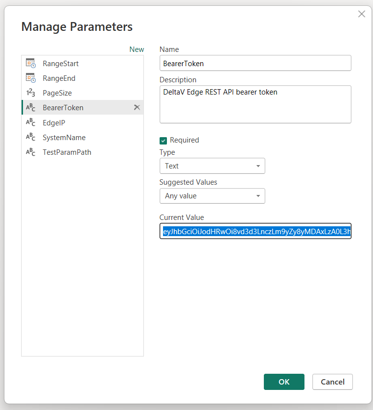<p>

### In Power BI Report Server (for published reports)

1. Open the Power BI Report Server web portal in a browser.
2. Navigate to the folder containing your report.
3. Hover over the report tile and click the three dot menu in the corner.
4. Click **Manage** from the menu.
5. In the left sidebar of the Manage page, click **Parameters**.
6. Find the `BearerToken` parameter in the list.
7. Paste the new token value into the BearerToken field.
8. Click **Apply** at the bottom of the page.

The next scheduled refresh (or manual refresh) will use the new token.

This is the main benefit of using parameters: rotation becomes a one minute task instead of a search and replace across every query in every report. The same applies to changing `EdgeIP` (when migrating to a new node), `PageSize` (for performance tuning), or `SystemName` (when retargeting reports to a different DeltaV system).

## Auto-Renewing the Token (Advanced)

If you have many reports and want to eliminate manual token rotation entirely, you can have Power Query call the auth endpoint itself on every refresh. Store the username and password as parameters and fetch a fresh token at the start of each query.

```m
let
    EdgeUsername = "your_edge_username",
    EdgePassword = EdgePasswordParam,

    AuthResponse = Json.Document(
        Web.Contents(
            "https://" & EdgeIP,
            [
                RelativePath = "edge/api/v1/Login/GetAuthToken/profile",
                Content = Text.ToBinary("username=" & EdgeUsername & "&password=" & EdgePassword),
                Headers = [
                    #"Content-Type" = "application/x-www-form-urlencoded"
                ]
            ]
        )
    ),
    Token = AuthResponse[accessToken],

    DataResponse = Json.Document(
        Web.Contents(
            "https://" & EdgeIP,
            [
                RelativePath = "edge/api/v2/ae",
                Headers = [Authorization = "Bearer " & Token]
            ]
        )
    )
in
    DataResponse
```

**Tradeoffs**: no manual rotation needed and the token is always fresh, but the password sits in a parameter on the server. Use a dedicated low-privilege Edge service account if you go this route, and set privacy levels on the data source to allow the two calls to chain.

## Common Issues

- **"The data source is using a dynamic data source" or "Information is required about data privacy"**: this can happen when the base URL is built from a parameter (as in this guide) and you publish to Power BI Service or Report Server. Two fixes:
    1. **In Power BI Desktop**: Go to **File > Options and settings > Data source settings**. Find your Edge data source, click **Edit Permissions**, set Privacy Level to **Organizational** or **Public** as appropriate, then click OK.
    2. **On Power BI Report Server**: After publishing the report, navigate to it on the web portal, click **Manage > Data sources**, and confirm the data source URL is set with **Anonymous authentication**. Some Report Server setups also expose a **Skip test connection** option when the URL is dynamic; enable it if available.
- **"No authorization" message**: the bearer token has expired. Generate a new one (Step 2) and update the `BearerToken` parameter (see Rotating the Bearer Token).
- **SSL/TLS certificate error**: the Edge REST API certificate is not trusted on the machine running Power BI. Revisit Step 1 and confirm the certificate is installed in the Trusted Root Certification Authorities store. For Report Server deployments, install it on the Report Server machine too.
- **Refresh works in Desktop but fails on Report Server**: usually one of the above (dynamic data source privacy settings or a missing certificate on the Report Server machine). Check both.
- **401 Unauthorized despite a fresh token**: check the `BearerToken` parameter value for extra spaces, quotes, or the word "bearer" pasted in by accident. The parameter should contain only the raw token string.
- **Incremental refresh policy is greyed out**: the query must reference `RangeStart` and `RangeEnd` (both Date/Time type) before Power BI allows you to enable incremental refresh. If you skipped these in Step 4, go back and create them.
- **Query returns fewer records than expected**: you are only pulling one page. A single API call returns at most `PageSize` records. For full results across a time range, use the pagination pattern in Step 11.

Set `EdgeIP`, `SystemName`, and `BearerToken` to your actual values. 🚀

And thats it! You can now retrieve your data from DeltaV Edge and connect it to Power BI to create reports, dashboards, or tables.
