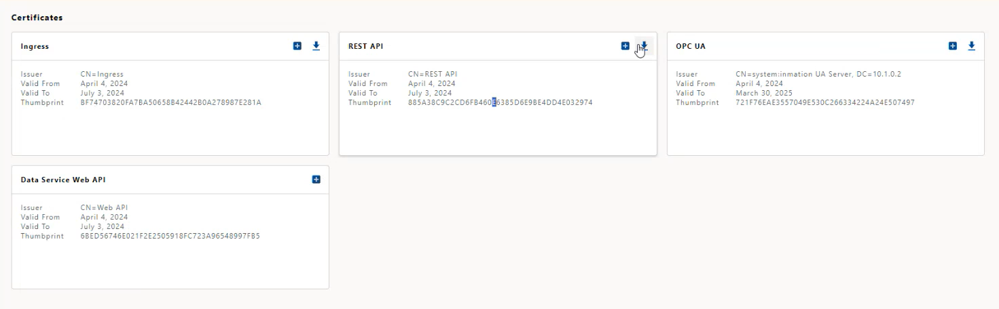
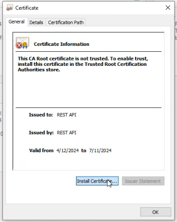
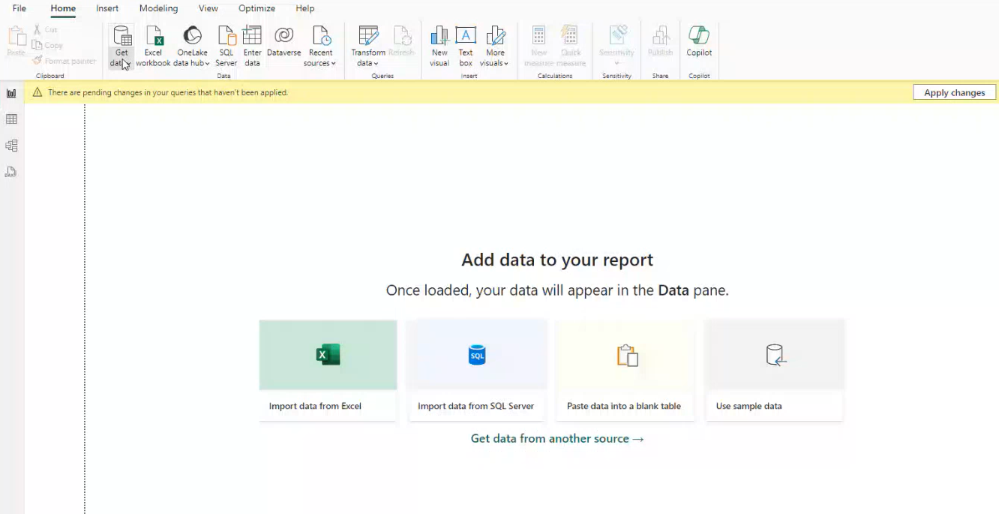
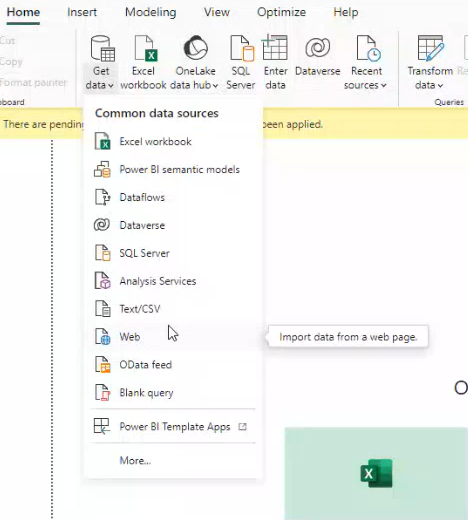
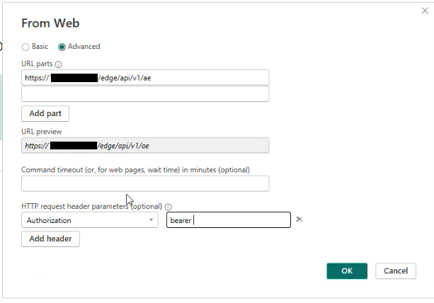
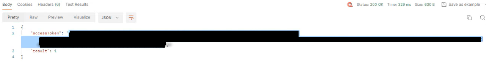

# How to use Edge Environment in the PowerBI

Here are step-by-step instructions for setting up your environment and configuring the necessary components to work with the Rest API Certificate and Bearer Token

1. **Download and Install the Rest API Certificate**:
    - If you already have the certificate, simply download it and proceed to install the DER Certificate.
    - In case the certificate is not available:
        1. Access your Edge Manager portal: Edge Manager
        2. Navigate to the "Certificates" section.  
        
        3. Generate the Rest API Certificate.  
        
        4. Download the certificate.
        5. Install it on your system.  
        

2. **Configure PowerBI for Rest API Access**:
    - Open PowerBI.  
    
    - Go to **Home > Get Data > Web**.  
    
    - A form will appear.  
    
    - Fill in the "URL Parts" with the appropriate details (e.g., `https://{edge ip}/edge/api/v1/ae`).

3. **Set HTTP Request Header Parameters**:
    - Add an HTTP request header parameter:
        - Name: `Authorization`
        - Value: `"bearer {bearer_token*}"`

4. **Obtain the Bearer Token**:
    - Query the following URL: `https://{edge ip}/edge/api/v1/Login/GetAuthToken/profile`.
    - Provide the necessary body parameters (Username and Password) to authenticate and retrieve the bearer token.

4. **Copy access token from the result and paste it in the PowerBI form**:  
    
    
Remember to replace `{edge ip}` with the actual IP address of your Edge server. These instructions will guide you in effectively using the Rest API and Bearer Token within PowerBI. 🚀

And thats it! You can now Retrieve your data to the PowerBI and Create Reports, Dashboard or Tables however you like