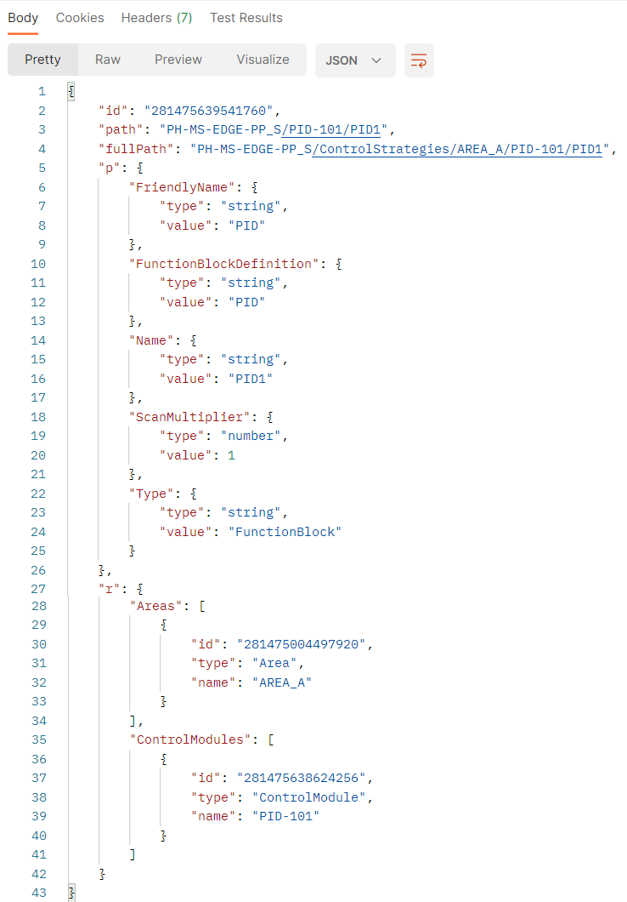
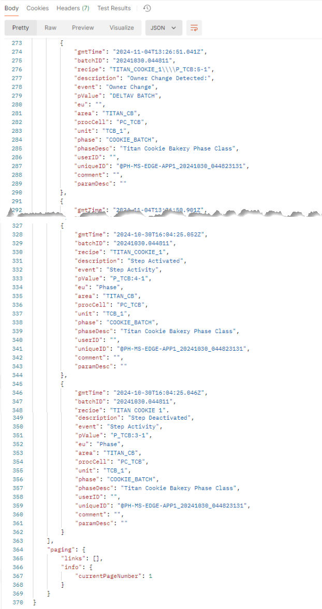

# Access Control Hierarchy Data

**Control Hierarchy Data** refers to the DeltaV system configuration, mainly its Entities (representations of the objects of interest in our domain) that make up the system hierarchy, from System to parameters and fields. This gives the user a replication of the configuration hierarchy for data contextualization.

Retrieve the control hierarchy data through the REST API Graph endpoint:
```
https://{edge_ip}/edge/api/v1/graph
```
where `{edge_ip}` is the IP address of the Edge Node Enterprise network (eth0). The REST
API on the Edge Node now also provides access to batch events data.

> NOTE: You need to generate a new access token when accessing data for the first time or if your scurrent token has expired. 

<br>

## Query by Entity ID

| Entities | Query by Entity ID | 
|-----|-----|
| General Form | ```https://{edge_ip}/edge/api/{version}/graph/{entity_id}``` |
| All entity properties  | ```https://{edge_ip}/edge/api/{version}/graph/{entity_id}?p=1```|
| Properties | ```https://{edge_ip}/edge/api/{version}/graph/{entity_id}?p={property1,property2}```|
| Module parameter name and type | ```https://{edge_ip}/edge/api/{version}/graph/{parameter_id}?p=name,type``` |
| Module parameter CV and ST | ```https://{edge_ip}/edge/api/{version}/graph/{parameter_id}?p=CV,ST```|
| Relationships | ```https://{edge_ip}/edge/api/{version}/graph/{entity_id}?r={relationship1,relationship2}```|
| All entity relationships | ```https://{edge_ip}/edge/api/{version}/graph/{entity_id}?r=1``` |
| Parents and Children of a Control Module | ```https://{edge_ip}/edge/api/{version}/graph/{module_id}?r=Parents,Children```|
| Control Modules and Parameters of a Function Block | ```https://{edge_ip}/edge/api/{version}/graph/{functionblock_id}?r=ControlModules,Parameters```|


Query by Entity ID works for all DeltaV objects under System provided that they have Entity IDs. 
Parameters and alarms that are not part of the runtime subscription do not have Entity IDs on the Edge REST API. 
They can only be queried by path.

- Alarm
- Area
- Control Module
- Engineering Unit
- Equipment Module
- Fieldbus Shadow Block
- Folder
- Formula
- Function Block
- Named Set
- Named State
- Operation
- Parameter
- Phase
- Procedure
- Process Cell
- Recipe Parameter
- SIS Module
- SIS Named Set
- SIS Named State
- Step
- System
- Transition
- Unit Module
- Unit Procedure

<br>

### Figure 1-2: Query all entity properties by Entity ID: 

```https://10.XXX.XXX.XXX/edge/api/v1/graph/281474981691392?p=1```


### Figure 1-3: Query all entity relationships by Entity ID:

```https://10.XXX.XXX.XXX/edge/api/v1/graph/281474981691392?r=1```


Batch hierarchy data can also be accessed by Entity ID on the graph endpoint. The Entity ID
is used to view the properties of a formula, as it is on the same level as steps, transitions,
and step parameters, preventing any conflicts.


### Figure 1-4: Query Batch Events Formula (DOUBLE_CHOCOLATE_CHIP) by Entity ID:

```https://10.XXX.XXX.XXX/edge/api/v1/graph/281475825664000```


<br>

## Query by Path

| | |
| -----|-----|
| **Entities** | **Query by Path** | 
| General Form | ```https://{edge_ip}/edge/api/{version}/graph?path={system_name}/{shortest_unique_path}``` |
| All entity properties  | ```https://{edge_ip}/edge/api/{version}/graph?path={system_name}/{shortest_unique_path}&p={property1,property2}``` |
| Properties | ```https://{edge_ip}/edge/api/{version}/graph?path={system_name}/{shortest_unique_path}&p=1``` |
| Module parameter name and type | ```https://{edge_ip}/edge/api/{version}/graph?path={system_name}/{module_name}/{parameter_name}&p=name,type``` |
| Module parameter CV and ST | ```https://{edge_ip}/edge/api/{version}/graph?path={system_name}/{module_name}/{parameter_name}&p=CV,ST``` |
| Relationships | ```https://{edge_ip}/edge/api/{version}/graph?path={system_name}/{shortest_unique_path}&r={relationship1,relationship2}``` |
| All entity relationships | ```https://{edge_ip}/edge/api/{version}/graph?path={system_name}/{shortest_unique_path}&r=1``` |
| Parents and Children of a Control Module  | ```https://{edge_ip}/edge/api/{version}/graph?path={system_name}/{module_name}&r=Parents,Children``` |
| Control Modules and Parameters of a Function Block | ```https://{edge_ip}/edge/api/{version}/graph?path={system_name}/{module_name}/{functionblock_name}&r=ControlModules,Parameters``` |


<br>
Query by Path works only for DeltaV objects under Control Strategies and Recipes:

- Alarm
- Area
- Control Module
- Equipment Module
- Fieldbus Shadow Block
- Function Blocks
- Operation
- Parameter
- Phase
- Procedure
- Process Cell
- Recipe Parameter
- SIS Module
- Step
- System
- Transition
- Unit Module
- Unit Procedure


### Figure 1-5: Query property by name by path: 
```https://10.XXX.XXX.XXX/edge/api/v1/graph?path=PH-MS-EDGE-PP_S/PID-101/PID1&p=name```


>Note
When filtering specific properties, all the relationships are still displayed. On the other
hand, when filtering specific relationships, all properties are still displayed.


### Figure 1-6: Query relationship by areas and control modules by path: 
```https://10.XXX.XXX.XXX/edge/api/v1/graph?path=PH-MS-EDGE-PP_S/PID-101/PID1&r=areas,controlmodules```




### Figure 1-7: Query Area by path: 
```https://10.XXX.XXX.XXX/edge/api/v1/graph?path=PH-MS-EDGE-PP_S/AREA_A```


### Figure 1-8: Query Control Module by path: 
```https://10.XXX.XXX.XXX/edge/api/v1/graph?path=PH-MS-EDGE-PP_S/PID-101```


### Figure 1-9: Query Parameter by path: 
```https://10.XXX.XXX.XXX/edge/api/v1/graph?path=PH-MS-EDGE-PP_S/PID-101/PID1/PV```


<br>

## Query Batch Events

Batch hierarchy data can be accessed by path on the graph endpoint. When you query recipes, the results displays the properties and relationships. It also shows child entities such as recipe parameters, steps, transitions, and other related entities, which can be
further categorized by type. 

This query exposes all entities from the system level down to the specific entity you are querying. The following recipes are unique within the system and are given the shortest path (system name/recipe name).


### Figure 1-11: Query Batch Events Unit Procedure (UPROC_BLENDER): 

```https://10.XXX.XXX.XXX/edge/api/v1/graph?path=DemoDeltaVSystem/UPROC_BLENDER```


### Figure 1-12: Query Batch Events Operation (TITAN_COOKIE_1): 

```https://10.XXX.XXX.XXX/edge/api/v1/graph?path=DemoDeltaVSystem/TITAN_COOKIE_1```


For properties of parameters under a recipe, you need to add the recipe name to the path
before the parameter (system name/recipe name/parameter name).

### Figure 1-13: Query Batch Events Step (P_TCB:1): 

```https://10.XXX.XXX.XXX/edge/api/v1/graph?path=DemoDeltaVSystem/TITAN_COOKIE_1/P_TCB:1```


### Figure 1-14: Query Batch Events Transition (T1): 
```https://10.XXX.XXX.XXX/edge/api/v1/graph?path=DemoDeltaVSystem/TITAN_COOKIE_1/T1```


> NOTE: 
To help recreate recipes in the same order as they appear in Recipe Studio, the
NextTransition and PreviousTransition indicators are added. These show the
previous and next steps, making the process easier to follow.

### Figure 1-15: Query Batch Events Step (P_TCB:2) with Next and Previous Transitions:
```https://10.XXX.XXX.XXX/edge/api/v1/graph?path=DemoDeltaVSystem/TITAN_COOKIE_1/P_TCB:2```


### Figure 1-16: Query Batch Events Recipe Parameter (COOKIE_TYPE): 
```https://10.XXX.XXX.XXX/edge/api/v1/graph?path=DemoDeltaVSystem/TITAN_COOKIE_1/COOKIE_TYPE```


> NOTE: 
Recipe parameters do not include child parameters because it is the last entity in the
hierarchy. For properties of steps, include the parameter name and the step parameter name.


### Figure 1-17: Query Batch Events Step Parameter (BSTATUS): 
```https://10.XXX.XXX.XXX/edge/api/v1/graph?path=DemoDeltaVSystem/TITAN_COOKIE_1/P_TCB:1/BSTATUS```


<br>
<br>

## Recipe Hierarchy

Batch procedural models and recipes are integrated into the Edge hierarchy to gain realtime
access to batch events. In DeltaV Explorer, the recipe hierarchy is located in System
Configuration → Recipes.

### Figure 1-18: Recipe hierarchy in DeltaV Explorer
Recipes are on the same level as Setup and Control Strategies. Phase instances are also
added and are located under Unit modules.


### Figure 1-19: Phases in the Edge Hierarchy

Follow the steps below to view the properties of the sample operation TITAN_COOKIE_1 in
DeltaV Explorer.
1. Navigate to System Configuration → Recipes → Operations → TITANCP → TITAN_COOKIE_1.
2. Right-click TITAN_COOKIE_1 and click Properties.


### Figure 1-20: TITAN_COOKIE_1 properties
All the properties of the operation TITAN_COOKIE_1 are displayed.


<br>
<br>

# Access Runtime Process Values (Parameter Data)

**Runtime Process Values** refer to the values of function block parameter fields being read at real-time. These provide actual, near-live values to make sense of ongoing processes.

You can monitor runtime updates to parameter fields by filtering the parameter field on the REST API Graph endpoint. Follow the syntax below to monitor parameter field values.

## Query by Path

| | |
| -----|-----|
| **Entities** | **Query by Path** | 
| General Form | ```https://{edge_ip}/edge/api/{version}/graph?path={system_name}/{shortest_unique_path}&p={fields}``` |
| Module Parameter Field | ```https://{edge_ip}/edge/api/{version}/graph?path={system_name}/{module_name}/{parameter_name}&p={fields}``` |
| Function Block Parameter Field | ```https://{edge_ip}/edge/api/{version}/graph?path={system_name}/{module_name}/{functionblock_name}/{parameter_name}&p={fields}``` |

### Figure 1-21: Query Function Block Parameter Field by path
```https://10.XXX.XXX.XXX/edge/api/v1/graph?path=PH-MS-EDGE-PP_S/PID-101/PID1/PV&p=CV```


## Query by Entity ID

| | |
| -----|-----|
| **Entities** | **Query by entity ID** | 
| General Form | ```https://{edge_ip}/edge/api/{version}/graph/{entity_id}?p={fields}``` |
| Module Parameter Field | ```https://{edge_ip}/edge/api/{version}/graph/{module_id}?p={fields}``` |
| Function Block Parameter Field | ```https://{edge_ip}/edge/api/{version}/graph/{functionblock_id}?p={fields}``` |

<br>
<br>

# Access Cached Process Values (Parameter Data)

**Cached Process Values** refer to the historical values of function block parameter fields. These provide a record of process values that can be used to observe trends and create reports.

Retrieve the cached Process Values data through the REST API History endpoint:
```
https://{edge_ip}/edge/api/v1/history
```

where `{edge_ip}` is the IP address of the Edge Node Enterprise network (eth0).

Follow the default syntax below to retrieve the latest 24h of cached parameter field values:

| | |
| -----|-----|
| **Entities** | **Queries** | 
| By Entity ID | ```https://{edge_ip}/edge/api/{version}/history/{param_id}?p={field}``` |
| By Path - Module Parameter Field (using p as key) | ```https://{edge_ip}/edge/api/{version}/history?path={system_name}/{module_name}/{parameter_name}&p={field}``` |
| By Path - Module Parameter Field (dot convention) | ```https://{edge_ip}/edge/api/{version}/history?path={system_name}/{module_name}/{parameter_name}.{field}``` |
| By Path - Function Block Parameter Field (using p as key) | ```https://{edge_ip}/edge/api/{version}/history?path={system_name}/{module_name}/{functionblock_name}/{parameter_name}&p={field}``` |
| By Path - Function Block Parameter Field (dot convention) | ```https://{edge_ip}/edge/api/{version}/history?path={system_name}/{module_name}/{functionblock_name}/{parameter_name}.{field}``` |

### Figure 1-22: Query Function Block Parameter (dot convention) by Path

```https://10.XXX.XXX.XXX/edge/api/v1/history?path=PH-MS-EDGE-PP_S/PID-101/PID1/PV.CV```


Specify the timespan of parameter field values you want to retrieve by adding StartTime and EndTime.

> Note:
Timeouts may occur if the specified timespan is long because REST API tries to return all the raw cached values within the timespan.

### Figure 1-23: Query Function Block Parameter Field (dot convention) with Timespan (EndTime and StartTime) by Path

```https://10.XXX.XXX.XXX/edge/api/v1/history?path=PH-MS-EDGE-PP_S/PID-101/PID1/PV.CV&EndTime=2023-09-17T11:00:00.000Z&StartTime=2023-09-16T11:00:00.000Z```


To reduce the number of data points for longer timespans, you can apply aggregate functions on the cached parameter field values.

Below is the list of aggregate functions that you can apply to cached parameter field values:

| | |
| -----|-----|
| **Function** | **Description** | 
| Interpolative | Returns the interpolated bounding value for the StartTime of each interval. |
| Average  | Adds up the values of all good raw data for each interval and divides the sum by the number of good values. It returns this average and the starttime of the interval. |
| TimeAverage | RCalculates the area under a sloped line which connects the interpolative start value, all good raw values and the interpolated bounding value at the end and divides this area by the length of the processing interval. It returns the time-weighted average and the starttime of the interval. |
| Total | This aggregate is the result of the TimeAverage calculation multiplied by the processing interval in seconds. It returns this total value and the starttime of the interval. |
| Minimum | Finds the minimum value of all good raw values and returns this value with the starttime of the interval. If multiple extremevalues exist the status 'multiple values' is set. |
| Maximum | Finds the maximum value of all good raw values and returns this value with the starttime of the interval. If multiple extremevalues exist, the status 'multiple values' is set. |
| MinimumActualTime | Detects the minimum value of all good raw values and returns this value with the timestamp at which that value occurs. If multiple extremevalues exist the oldest one is retrieved, and the status 'multiple values' is set. |
| MaximumActualTime | Detects the maximum value of all good raw values and returns this value with the timestamp at which that value occurs. If multiple extremevalues exist the oldest one is retrieved, and the status 'multiple values' is set. |
| Range | Calculates the difference between the maximum and the minimum of all good raw values and returns the starttime of the interval. If only one good value exists, the range is zero, otherwise it is always positive. |
| Count | Retrieves the count of good raw values. |
| Start | Retrieves the earliest raw value within the interval and returns that value and status with the timestamp at which that value occurs. |
| End |Retrieves the latest raw value within the interval and returns that value and status with the timestamp at which that value occurs. |

### Figure 1-24: Query with Aggregation


```https://10.XXX.XXX.XXX/edge/api/v1/history?path=PH-DI-ST-PP1_S/ALL_PARAM_TYPES/UINT16.CV&EndTime=2023-10-16T06:05:28.648Z&StartTime=2023-10-16T05:56:28.649Z&Aggregation=Average&Interval=3```

<br>
<br>

# Access Cached Alarms and Events Data

**Alarms & Events** data refer to any noteworthy occurrence in your process or system. These provide records of events that you want the system to react to, or to be brought to the operator's attention. 

Retrieve the cached Alarms and Events records through the REST API AE endpoint:
```
https://{edge_ip}/edge/api/v1/ae
```
where {edge_ip} is the IP address of the Edge Node Enterprise network (eth0).

### Figure 1-25: Query Alarms & Events

```https://10.XXX.XXX.XXX/edge/api/v1/ae```


- Specify the timespan of alarm & event records you want to retrieve by adding StartTime and EndTime.

- You can add the filter PS (page size) to adjust the number of records returned. 
For example, PS = 10000 returns up to 10,000 records in one page within the specified interval.

- To page through the records, add PN (page number) to the URL. Increment to go to the next page and decrement to go back to the previous page. When paging through the records, do not remove the StartTime and EndTime to ensure that records do not move.

### Figure 1-26: Query Alarms and Events with timespan (StartTime, EndTime) and Page Number (PN)

```https://10.XXX.XXX.XXX/edge/api/v1/ae?starttime=2024-11-13T05:50:11.889Z&endtime=2024-11-13T05:50:12.379Z&PN=1```


You can also filter the records by property. All the available properties can be used as a filter parameter.

### Figure 1-27: Query Alarms and Events with Property
```https://10.XXX.XXX.XXX/edge/api/v1/ae?Level=Critical,Warning```


### Figure 1-28: Query Alarms and Events with timespan (StartTime, EndTime) and Property

```https://10.XXX.XXX.XXX/edge/api/v1/ae?StartTime=2023-09-12T00:54:28.0218849Z&EndTime=2023-09-16T00:54:28.0217930Z&module=PID-111&level=CRITICAL```

# Access Cached Batch Events

The REST API on the Edge Node now has access to batch events data. The table below lists
the new entity types and their descriptions added to support batch data.

Table 1-1: Batch events entities


| | |
| -----|-----|
| **Entity** | **Description** | 
| Procedure | Major stages of the process |
| Unit Procedure | Smaller segments of the procedure | 
| Operation | Represents the tasks that need to be executed within each step |
| Step | A series of operation or tasks that need to be executed to complete the unit procedure |
| Phases | Individual control actions required to perform an operation |
| Transition | Guides the flow between steps of procedures, unit procedures, or operations |
| Recipe | Parameter Adjustable settings within a recipe that influence how the process is carried out |
| Formula | Sets of parameters that define how a recipe is to be executed for a particular batch |
| | |

<br>

Batch events are modeled the same way as alarms and events. All alarms and events
queries are applicable to batch events. 

You can retrieve the latest 1 hour batch event records through the REST API endpoint using the default syntax below, where `{edge_ip}` is the IP address of the **Edge Node Enterprise network (eth0)**.

```https://{edge_ip}/edge/api/v1/batchevent```


### Figure 1-29: Query Alarms & Events

```https://10.XXX.XXX.XXX/edge/api/v1/batchevent```


### Figure 1-30: Query Batch Events by Property


```https://10.XXX.XXX.XXX/edge/api/v1/batchevent?starttime=2023-10-01T00:00:00.000Z&batchID=20241030.044811```


### Figure 1-31: Query Batch Events with timespan (StartTime, EndTime) and Page Number (PN)

```https://10.XXX.XXX.XXX/edge/api/v1/batchevent?endtime=2024-10-30T16:04:25.213Z&starttime=2024-10-30T16:00:41.804Z&PN=1```


### Figure 1-32: Query Batch Events with timespan (StartTime, EndTime) and Page Number (PN) with Event using a comma

```https://10.XXX.XXX.XXX/edge/api/v1/batchevent?starttime=2024-10-30T16:00:41.804Z&endtime=2024-10-30T16:04:25.213Z&PN=1,event=State Change```


### Figure 1-33:  Query Batch Events with start time (StartTime) AND Recipe 

```https://10.XXX.XXX.XXX/edge/api/v1/batchevent?starttime=2024-10-30T16:00:41.804Z&Recipe=TITAN_COOKIE_1,TITAN_COOKIE_1\\\\P_TCB:5-1```

