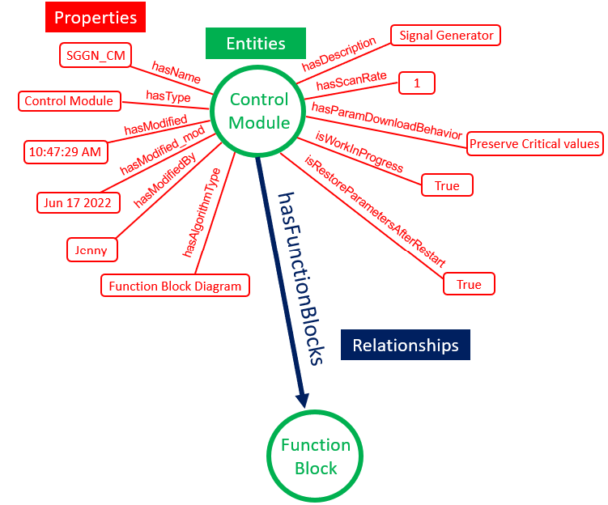
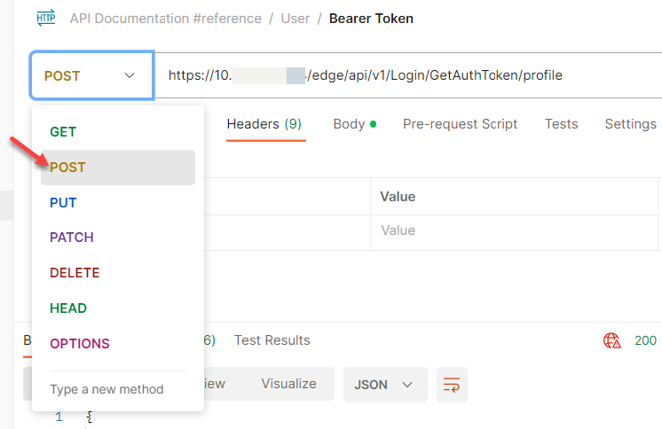
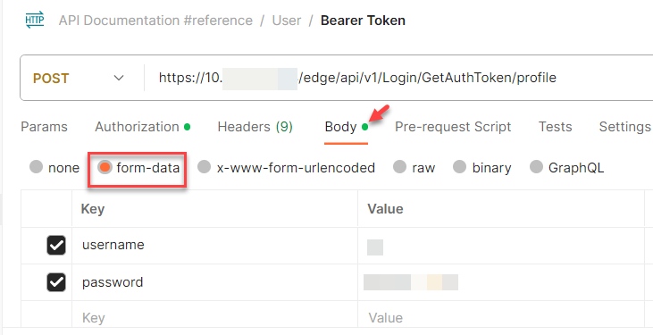
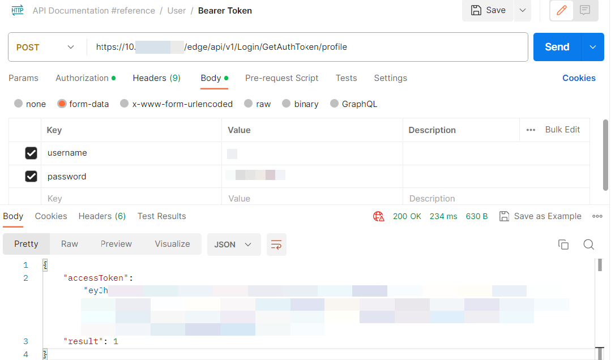
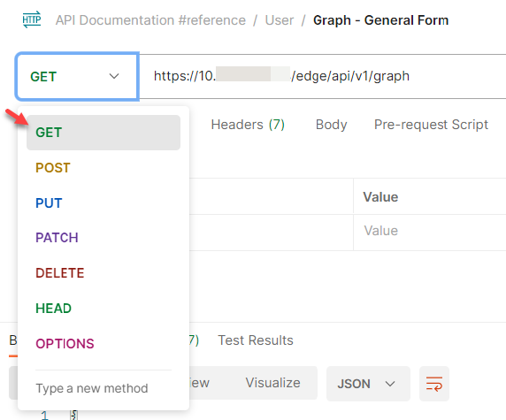

# Access DeltaV Data on the Edge Node through REST API

REST API is built on a knowledge graph where information is encoded on a graph data
structure with nodes (Entities), edges (Relationships), and attributes (Properties).

|    | Description | Examples | 
| ---- | ------  | --------- |
| `Entities` | Objects of interest in our domain | 	Control module, function block |
| `Relationships` | Relationships	Hierarchical relationship between one entity and another entity | Function blocks of a control module |
| `Properties` | Information about an entity | Scan rate of a control module |




The Edge REST API provides a rich set of text-based data on the entity being queried and its associated parameters. You can retrieve the following data from the Edge through the REST API:

- Control hierarchy

- Runtime parameter

- Cached parameter

- Cached alarms & events


# Edge REST API Authentication


Before accessing the Edge REST API data, you need to generate an access token and use the token for authorization. You may use applications such as Postman or cURL to generate the token and use it for authentication.

1. Send a POST request to the Edge Node by clicking the Method drop-down list and click POST.



2. Enter the URL: 
```
https://{edge_ip}/edge/api/v1/Login/GetAuthToken/profile
```
where `{edge_ip}` is the IP address of the Edge Node Enterprise network (eth0).

> : If generating the access token using an Active Directory user, use the Edge REST API endpoint: `https://{edge_ip}/edge/api/v1/Login/GetAuthToken/activedirectory`


3. Go to the Body tab and select **form-data**.

4. Enter a valid username and password key-value pair. You may use any created
Profile or Active Directory user on the DeltaV Edge Manager.



> Note: Set the profile to Available in the DeltaV Edge Manager to ensure that the profile
can access the Edge REST API. See Section 2.3 Login Methods for more information.


5. Click Send. The access token is generated.



6. Copy the access token.

7. To get data, send a GET request to the Edge REST API URL by clicking the Method
drop-down list and clicking GET. Then enter the URL below:
```
https://{edge_ip}/edge/api/v1/graph
```


9. Go to the Authorization tab.

10. From the Type drop-down list, select Bearer Token.
![Figure 6-6: Bearer Token].(6-6-bearer-token.png)

11. Paste the copied access token in the Token field.

12. Click Send to show the information.


> Note:
The access token expires every 24 hours. If your token lifespan is expired, the software displays a No authorization message. The access token lifespan can be set on the DeltaV Edge Manager. Refer to the Authentication topic for more information. Generate a new access token and use it to authorize succeeding REST API calls when the token expires.


# Querying Properties and Relationships via REST API

Once you have obtained authorization to access the Edge REST API, you can obtain
information (properties and relationships) about the different entities using:

- Query by Path

- Query by Entity ID


## Query by Path:


| General Form | Query by Path | 
|-----|-----|
| Hierarchy | ```https://{edge_ip}/edge/api/{version}/graph?path={system_name}/{shortest_unique_path}``` |
| Runtime | ```https://{edge_ip}/edge/api/{version}/graph?path={system_name}/{shortest_unique_path}&p={fields}```|
| History | ```https://{edge_ip}/edge/api/{version}/history?path={system_name}/{shortest_unique_path}&p={field}```|

Query by Path works only for DeltaV objects under Control Strategies:

- System

- Area

- Process Cell

- Unit Module

- Equipment Module

- Control Module

- SIS Module

- Function Blocks

- Fieldbus Shadow Block

- Parameter

- Alarm

## Query by Entity ID

| General Form | Query by Entity ID | 
|-----|-----|
| Hierarchy | ```https://{edge_ip}/edge/api/{version}/graph/{entity_id}``` |
| Runtime | ```https://{edge_ip}/edge/api/{version}/graph/{entity_id}?p={fields}```|
| History | ```https://{edge_ip}/edge/api/{version}/history/{param_id}?p={field}```|

Query by Entity ID works for all DeltaV objects under System provided that they have
Entity IDs. Parameters and alarms that are not part of the runtime subscription do not
have Entity IDs on the Edge REST API. They can only be queried by path.

- System

- Area

- Process Cell

- Unit Module

- Equipment Module

- Control Module

- SIS Module

- Function Blocks

- Fieldbus Shadow Block

- Parameter

- Alarm

- Named Sets

- Named States

- SIS Named Sets

- SIS Named States

- Engineering Units

- Folders


There are different categories of data that can be accessed through REST API:

- Control Hierarchy Data
  
- Runtime Process Values
  
- Cached Process Values 

- Cached Alarms and Events 


**Control Hierarchy Data** refers to the DeltaV system configuration, mainly its Entities (representations of the objects of interest in our domain) that make up the system hierarchy, from System to parameters and fields. This gives the user a replication of the configuration hierarchy for data contextualization.

**Runtime Process Values** refer to the values of function block parameter fields being read at real-time. These provide actual, near-live values to make sense of ongoing processes.

**Cached Process Values** refer to the historical values of function block parameter fields. These provide a record of process values that can be used to observe trends and create reports.

**Alarms & Events** data refer to any noteworthy occurrence in your process or system. These provide records of events that you want the system to react to, or to be brought to the operator's attention. 
 
For more detailed instructions, please refer to [REST API Acess Data](./rest-api-data-access/rest-api-access-data.md)

# Mock Server

Please refer to the link below for the mock server. You can use this to explore our REST APIs.

`https://8b1e38e9-9001-4711-950c-437a4310f80d.mock.pstmn.io/edge/`

Please note that the current mock server is limited only to 1k usage a month.
