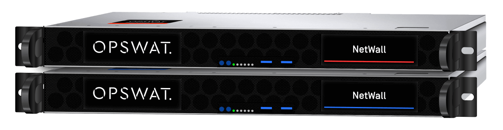

# DeltaV Edge Environment v1.0 Release Info

|Specification|Description|
|---|---|
| Compatibility | DeltaV v14.LTS, v14.FP1, v14.FP2, v14.FP3, and v15.LTS |
| Number of Supported Data Items | 20k, 100k, 300k |
| Supported Sampling Periods | 1s, 2s, 5s, 10s, 60s |
| Alarms and Events Handling | 100 events/second, 4K peak alarm burst handling |
| Data Types Supported | DeltaV S88 Plant Hierarchy, Configuration Data, Process Values, Alarms & Events, SIS Module Data |
| DeltaV Objects/Entities Supported | System, Area, Process Cell, Unit Module, Equipment Module, Control Module, Function Block, Fieldbus Shadow Block, Parameter, Alarm, Named Set, SIS Module, Named State, Engineering Unit, SIS Named Set, SIS Named State, Folder, Field, #Properties, #Config |
| Edge Node's Operating System | [EVE-OS v9.4.6-lts](https://github.com/EmersonDeltaV/lf-edge-eve) (Linux-based OS)|

## Edge Node	

DeltaV Edge Environment uses Dell PowerEdge R650xs Rack Mounted Server

|  Edge Server Hardware Specifications  |
| ------------------------------------------------------------------------------------------------- |
| o	Dual CPU Intel Xeon Gold 5315Y 3.2G, 8C/16T, 11.2GT/s, 12M Cache, Turbo, HT (140W) DDR4-2933   |
| o	128 GB Memory - Two 64 GB RDIMM, 3200MT/s, Dual Rank 16Gb BASE x8                              |
| o	12TB SSD - Seven 1.92TB Hot-plug Read-intensive Solid State Drives 6Gbps 2.5” in a RAID5 Array | 
| o	PERC H745 RAID Controller, Front                                                               | 
| o	Dual, Hot-Plug, Redundant Power Supply (1+1), 600W                                             | 
| o	No pre-installed operating system                                                              | 
| o	Ethernet ports: 6                                                                             | 
| o	Includes drop-in/stab-in combo rails without cable management arm                             | 
| o	1U, Height 42.8mm (1.68in), Width 482mm (18.97in), Depth 748.79mm (29.47in)                   |  
| o	OS: EVE-OS                                                                                    |

## Data Diode	(Optional)

The OPSWAT MetaDefender Optical Diode. 
 

For the DeltaV Edge Environment, MetaDefender Optical Diode 100MB and 1GB data transfer rates are supported options. This solution enables you to connect the Data Provider directly to the Edge Node for a secure and simplified IT network solution.

