_Intro here_


# Access Control Hierarchy Data

__describe this the purpose of this section__

Retrieve the control hierarchy data through the REST API Graph endpoint:
```
https://{edge_ip}/edge/api/v1/graph
```
where `{edge_ip}` is the IP address of the Edge Node Enterprise network (eth0).

## Query by Path

| | |
| -----|-----|
| **Entities** | **Query by Path** | 
| General Form | ```https://{edge_ip}/edge/api/{version}/graph?path={system_name}/{shortest_unique_path}``` |
| All entity properties  | ```https://{edge_ip}/edge/api/{version}/graph?path={system_name}/{shortest_unique_path}&p={property1,property2}``` |
| Properties | ```https://{edge_ip}/edge/api/{version}/graph?path={system_name}/{shortest_unique_path}&p=1``` |
| Module parameter name and type | ```https://{edge_ip}/edge/api/{version}/graph?path={system_name}/{module_name}/{parameter_name}&p=name,type``` |
| Module parameter CV and ST | ```https://{edge_ip}/edge/api/{version}/graph?path={system_name}/{module_name}/{parameter_name}&p=CV,ST``` |
| Relationships | ```https://{edge_ip}/edge/api/{version}/graph?path={system_name}/{shortest_unique_path}&r={relationship1,relationship2}``` |
| All entity relationships | ```https://{edge_ip}/edge/api/{version}/graph?path={system_name}/{shortest_unique_path}&r=1``` |
| Parents and Children of a Control Module  | ```https://{edge_ip}/edge/api/{version}/graph?path={system_name}/{module_name}&r=Parents,Children``` |
| Control Modules and Parameters of a Function Block | ```https://{edge_ip}/edge/api/{version}/graph?path={system_name}/{module_name}/{functionblock_name}&r=ControlModules,Parameters``` |

### Example: Query property by name by path

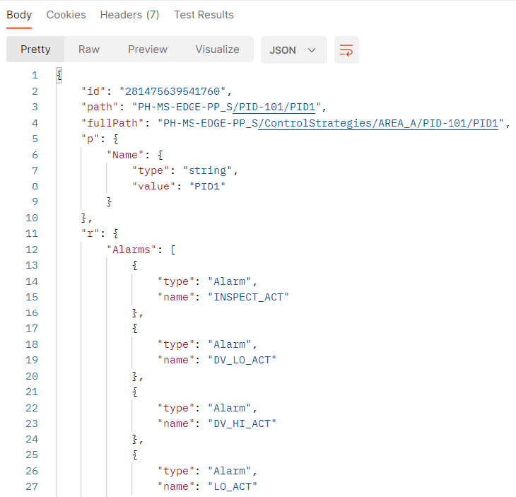

### Example: Query relationship by areas and control modules by path

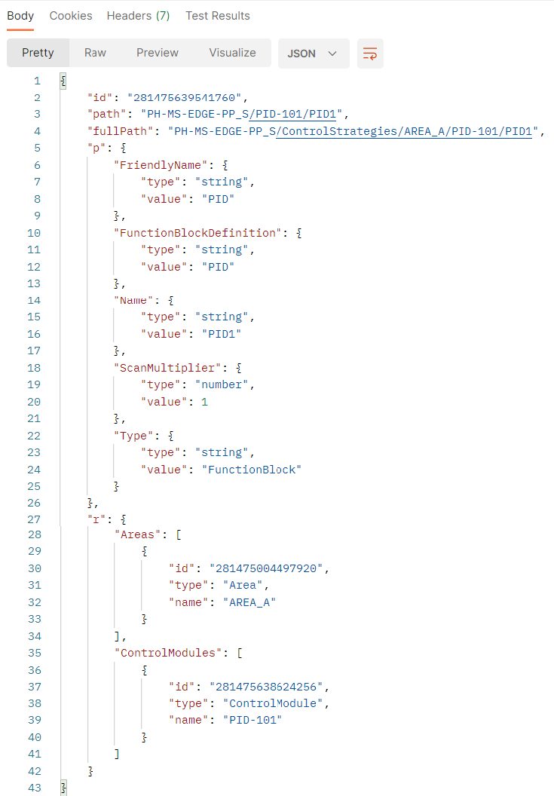

### Example: Query Area by path (AREA_A)

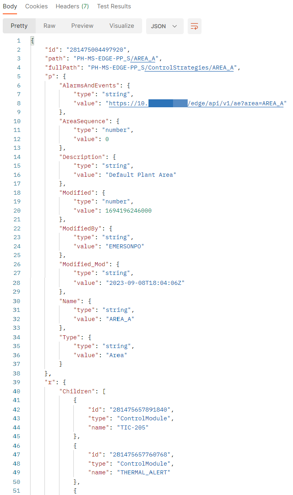

### Example: Query Control Module by path (PID-101)

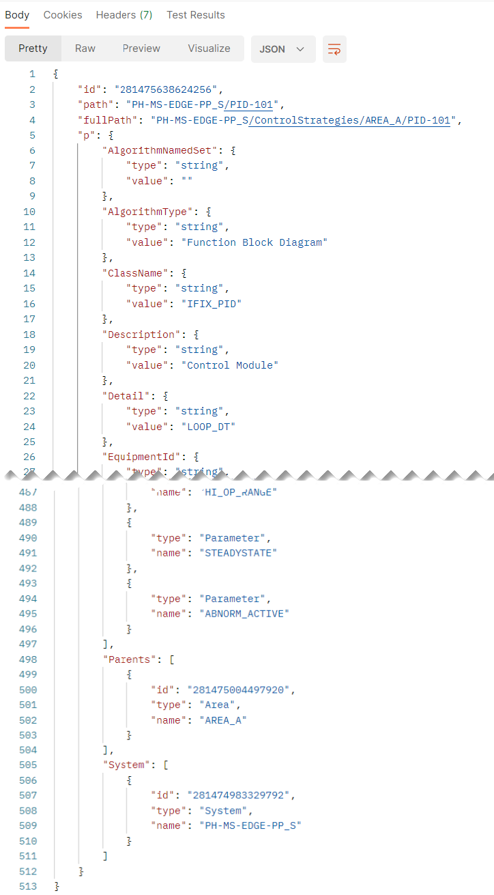

### Example: Query Parameter by path

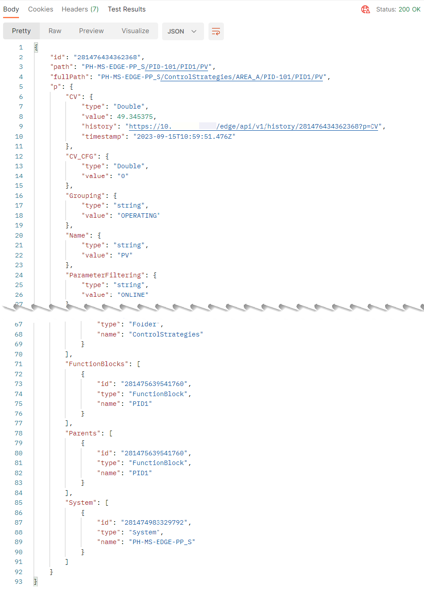

## Query by Entity ID

| | |
| -----|-----|
| **Entities** | **Query by entity ID** | 
| General Form | ```https://{edge_ip}/edge/api/{version}/graph/{entity_id}``` |
| All entity properties  | ```https://{edge_ip}/edge/api/{version}/graph/{entity_id}?p=1``` |
| Properties | ```https://{edge_ip}/edge/api/{version}/graph/{entity_id}?p={property1,property2}``` |
| Module parameter name and type | ```https://{edge_ip}/edge/api/{version}/graph/{parameter_id}?p=name,type``` |
| Module parameter CV and ST | ```https://{edge_ip}/edge/api/{version}/graph/{parameter_id}?p=CV,ST``` |
| Relationships | ```https://{edge_ip}/edge/api/{version}/graph/{entity_id}?r={relationship1,relationship2}``` |
| All entity relationships | ```https://{edge_ip}/edge/api/{version}/graph/{entity_id}?r=1``` |
| Parents and Children of a Control Module  | ```https://{edge_ip}/edge/api/{version}/graph/{module_id}?r=Parents,Children``` |
| Control Modules and Parameters of a Function Block | ```https://{edge_ip}/edge/api/{version}/graph/{functionblock_id}?r=ControlModules,Parameters``` |


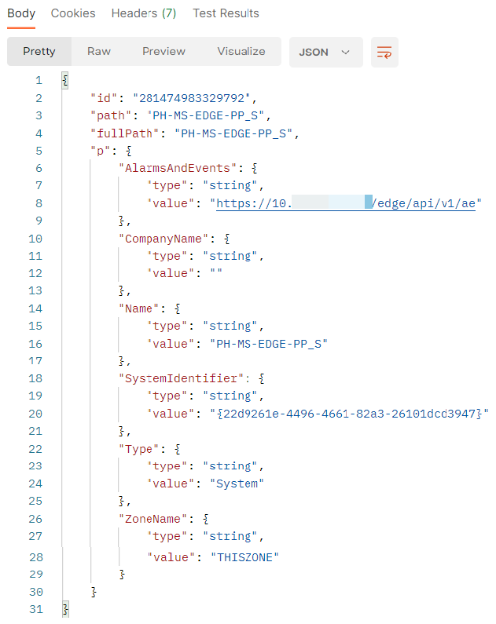

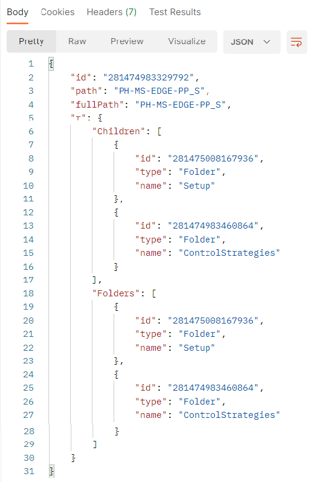


# Access Runtime Process Values (Parameter Data)

You can monitor runtime updates to parameter fields by filtering the parameter field on the REST API Graph endpoint. Follow the syntax below to monitor parameter field values.

## Query by Path

| | |
| -----|-----|
| **Entities** | **Query by Path** | 
| General Form | ```https://{edge_ip}/edge/api/{version}/graph?path={system_name}/{shortest_unique_path}&p={fields}``` |
| Module Parameter Field | ```https://{edge_ip}/edge/api/{version}/graph?path={system_name}/{module_name}/{parameter_name}&p={fields}``` |
| Function Block Parameter Field | ```https://{edge_ip}/edge/api/{version}/graph?path={system_name}/{module_name}/{functionblock_name}/{parameter_name}&p={fields}``` |

### Example: Query Function Block Parameter Field by path
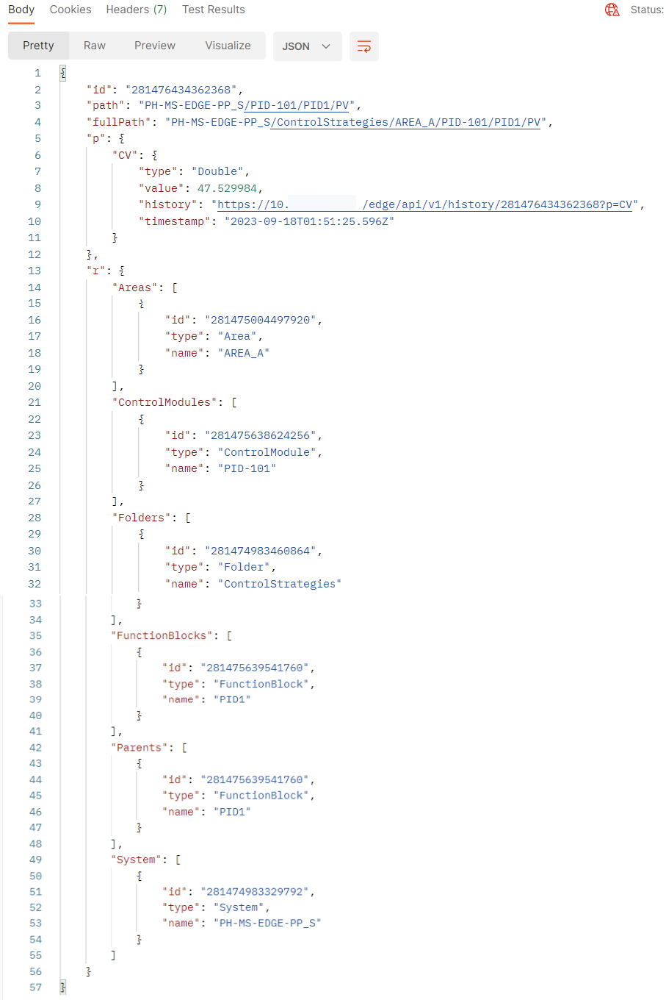


## Query by Entity ID

| | |
| -----|-----|
| **Entities** | **Query by entity ID** | 
| General Form | ```https://{edge_ip}/edge/api/{version}/graph/{entity_id}?p={fields}``` |
| Module Parameter Field | ```https://{edge_ip}/edge/api/{version}/graph/{module_id}?p={fields}``` |
| Function Block Parameter Field | ```https://{edge_ip}/edge/api/{version}/graph/{functionblock_id}?p={fields}``` |


# Access Cached Process Values (Parameter Data)


Retrieve the cached Process Values data through the REST API History endpoint:
```
https://{edge_ip}/edge/api/v1/history
```
where {edge_ip} is the IP address of the Edge Node Enterprise network (eth0).

Follow the default syntax below to retrieve the latest 24h of cached parameter field values:

| | |
| -----|-----|
| **Entities** | **Queries** | 
| By Entity ID | ```https://{edge_ip}/edge/api/{version}/history/{param_id}?p={field}``` |
| By Path - Module Parameter Field (using p as key) | ```https://{edge_ip}/edge/api/{version}/history?path={system_name}/{module_name}/{parameter_name}&p={field}``` |
| By Path - Module Parameter Field (dot convention) | ```https://{edge_ip}/edge/api/{version}/history?path={system_name}/{module_name}/{parameter_name}.{field}``` |
| By Path - Function Block Parameter Field (using p as key) | ```https://{edge_ip}/edge/api/{version}/history?path={system_name}/{module_name}/{functionblock_name}/{parameter_name}&p={field}``` |
| By Path - Function Block Parameter Field (dot convention) | ```https://{edge_ip}/edge/api/{version}/history?path={system_name}/{module_name}/{functionblock_name}/{parameter_name}.{field}``` |

### Example: Query Function Block Parameter (dot convention) by Path
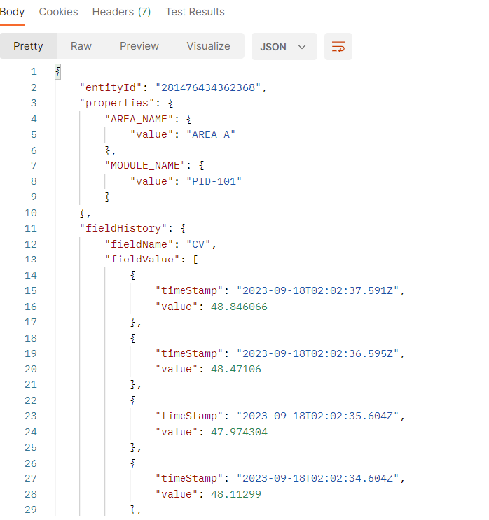

Specify the timespan of parameter field values you want to retrieve by adding StartTime and EndTime.

> Note:
Timeouts may occur if the specified timespan is long because REST API tries to return all the raw cached values within the timespan.

### Example: Query Function Block Parameter (dot convention) by Path
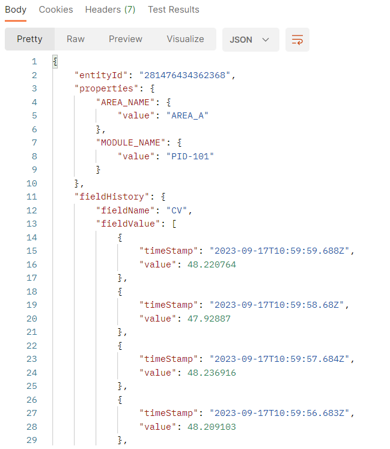

To reduce the number of data points for longer timespans, you can apply aggregate functions on the cached parameter field values.

Below is the list of aggregate functions that you can apply to cached parameter field values:

| | |
| -----|-----|
| **Function** | **Description** | 
| Interpolative | Returns the interpolated bounding value for the StartTime of each interval. |
| Average  | Adds up the values of all good raw data for each interval and divides the sum by the number of good values. It returns this average and the starttime of the interval. |
| TimeAverage | RCalculates the area under a sloped line which connects the interpolative start value, all good raw values and the interpolated bounding value at the end and divides this area by the length of the processing interval. It returns the time-weighted average and the starttime of the interval. |
| Total | This aggregate is the result of the TimeAverage calculation multiplied by the processing interval in seconds. It returns this total value and the starttime of the interval. |
| Minimum | Finds the minimum value of all good raw values and returns this value with the starttime of the interval. If multiple extremevalues exist the status 'multiple values' is set. |
| Maximum | Finds the maximum value of all good raw values and returns this value with the starttime of the interval. If multiple extremevalues exist, the status 'multiple values' is set. |
| MinimumActualTime | Detects the minimum value of all good raw values and returns this value with the timestamp at which that value occurs. If multiple extremevalues exist the oldest one is retrieved, and the status 'multiple values' is set. |
| MaximumActualTime | Detects the maximum value of all good raw values and returns this value with the timestamp at which that value occurs. If multiple extremevalues exist the oldest one is retrieved, and the status 'multiple values' is set. |
| Range | Calculates the difference between the maximum and the minimum of all good raw values and returns the starttime of the interval. If only one good value exists, the range is zero, otherwise it is always positive. |
| Count | Retrieves the count of good raw values. |
| Start | Retrieves the earliest raw value within the interval and returns that value and status with the timestamp at which that value occurs. |
| End |Retrieves the latest raw value within the interval and returns that value and status with the timestamp at which that value occurs. |

### Example: Query Function Block Parameter (dot convention) by Path
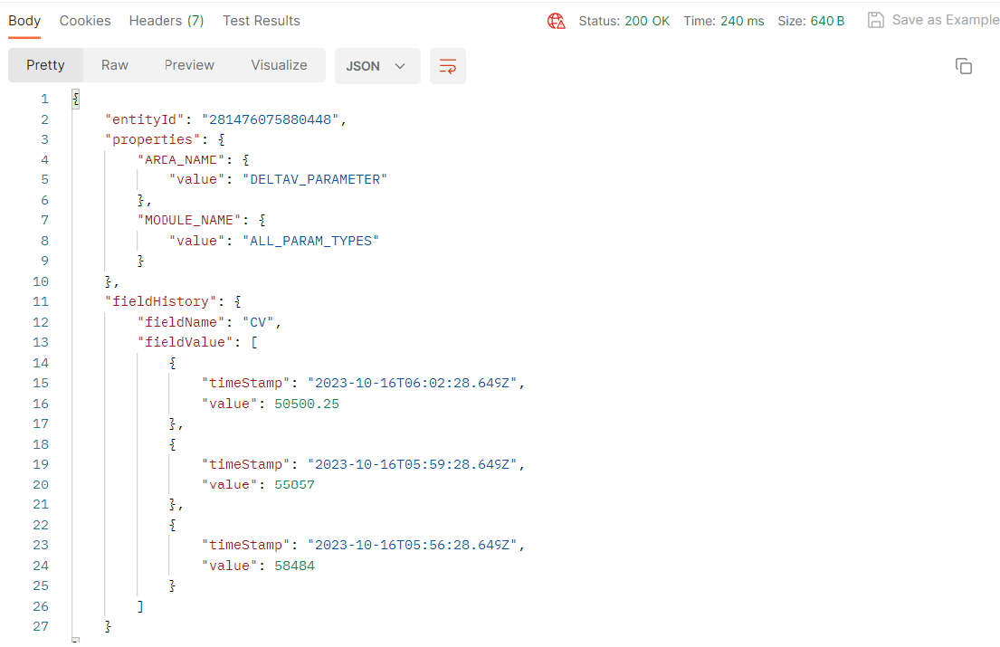


# Access Cached Alarms and Events Data

Retrieve the cached Alarms and Events records through the REST API AE endpoint:
```
https://{edge_ip}/edge/api/v1/ae
```
where {edge_ip} is the IP address of the Edge Node Enterprise network (eth0).

### Example: Query Alarms & Events
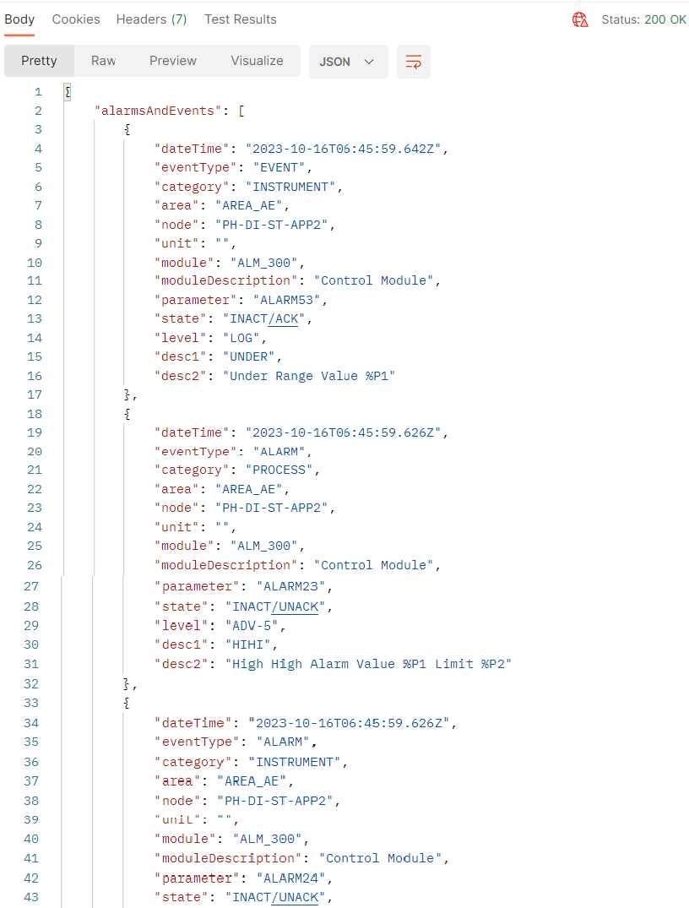

• Specify the timespan of alarm & event records you want to retrieve by adding StartTime and EndTime.

• You can add the filter PS (page size) to adjust the number of records returned. 
For example, PS = 10000 returns up to 10,000 records in one page within the specified interval.

• To page through the records, add PN (page number) to the URL. Increment to go to the next page and decrement to go back to the previous page. When paging through the records, do not remove the StartTime and EndTime to ensure that records do not move.

### Example: Query Alarms and Events with Timespan
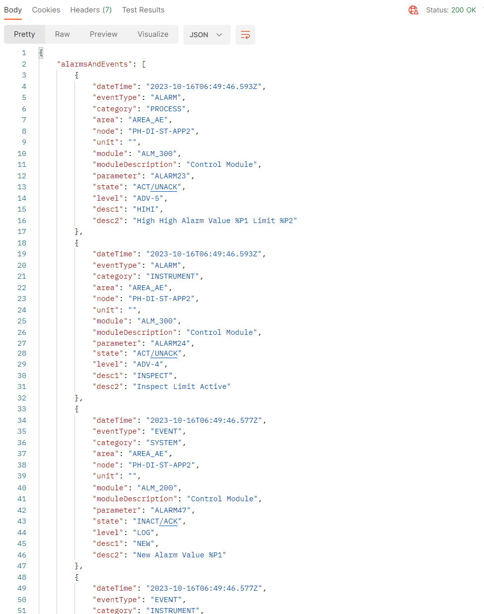

You can also filter the records by property. All the available properties can be used as a filter parameter.

### Example: Query Alarms and Events with Timespan and Property

