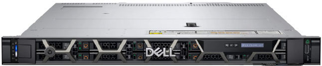
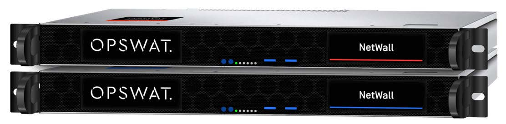

# DeltaV Edge Environment System Components

## Data Provider	

The Data Provider Service is installed on a physical server class DeltaV Application Station.
It supports the following DeltaV versions:

o 14.LTS

o 14.FP1

o 14.FP2

o 14.FP3

o 15.LTS

Data Provider streams hierarchy & configuration values, process values, and alarms & events from the DeltaV system to the Edge Node via HTTPS.
It also comes with the Data Provider Configuration Tool (used to configure parameter data subscription).

|  Performance and System Scalability |
| ------------------------------------------ | 
| Parameter Data	30,000 data-items/second |
| 300,000 unique data-items |
| Alarms and Events	100 events/second, up to 4,000 peak event spike without loss |
| Transportation	HTTPS |
 

## Edge Node	

DeltaV Edge Environment uses Dell PowerEdge R650xs Rack Mounted Server

|  Edge Server Hardware Specifications  |
| ------------------------------------------------------------------------------------------------- |
| o	Dual CPU Intel Xeon Gold 5315Y 3.2G, 8C/16T, 11.2GT/s, 12M Cache, Turbo, HT (140W) DDR4-2933   |
| o	128 GB Memory - Two 64 GB RDIMM, 3200MT/s, Dual Rank 16Gb BASE x8                              |
| o	12TB SSD - Seven 1.92TB Hot-plug Read-intensive Solid State Drives 6Gbps 2.5” in a RAID5 Array | 
| o	PERC H745 RAID Controller, Front                                                               | 
| o	Dual, Hot-Plug, Redundant Power Supply (1+1), 600W                                             | 
| o	No pre-installed operating system                                                              | 
| o	Ethernet ports: 6                                                                             | 
| o	Includes drop-in/stab-in combo rails without cable management arm                             | 
| o	1U, Height 42.8mm (1.68in), Width 482mm (18.97in), Depth 748.79mm (29.47in)                   |  
| o	OS: EVE-OS                                                                                    |

# Data Diode	

The OPSWAT NetWall Optical Diode. 
 

For the DeltaV Edge Environment, NetWall 100MB and 1GB data transfer rates are supported options. This solution enables you to connect the Data Provider directly to the Edge Node for a secure and simplified IT network solution.

