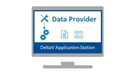
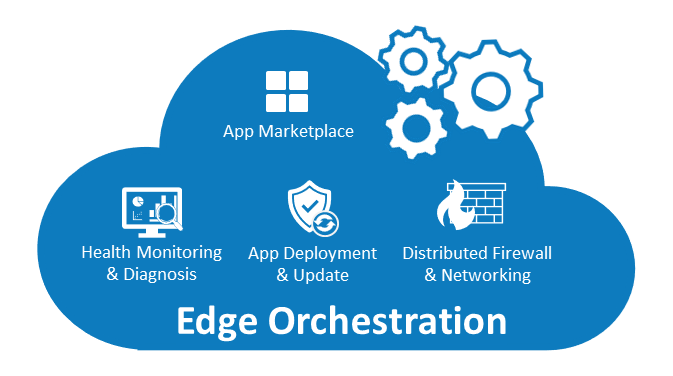
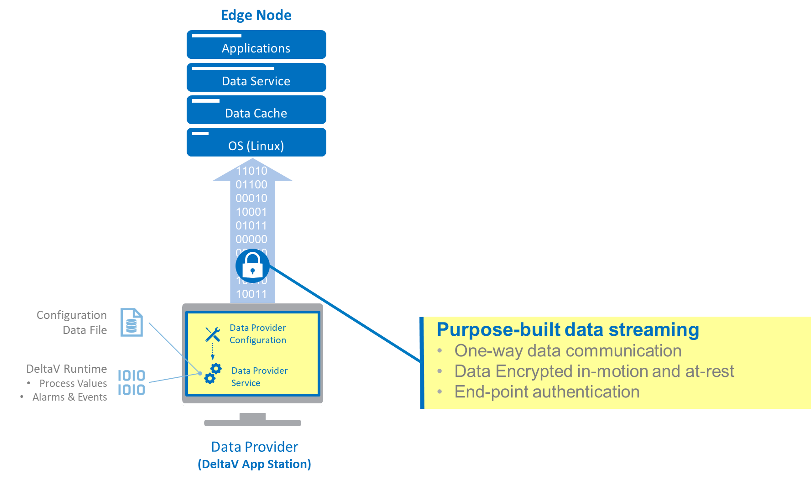
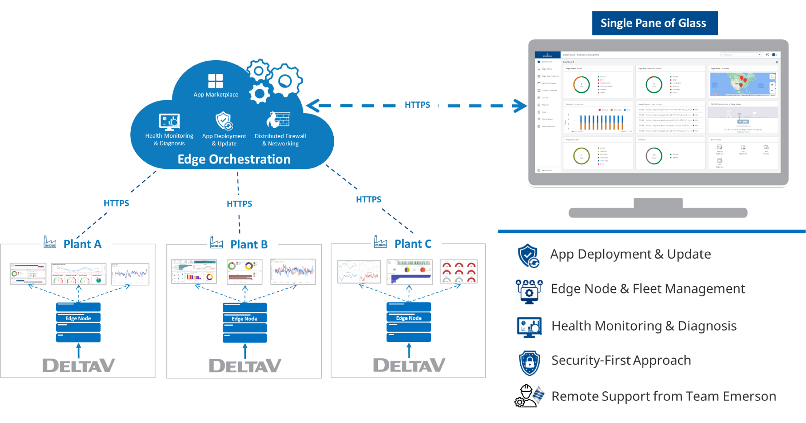

# DeltaV Edge Environment System Components

The DeltaV Edge Environment provides access to DeltaV system data through a unified solution architecture while satisfying IT cybersecurity, communications, and application requirements—all without disrupting the DeltaV system. 

The DeltaV Edge Environment solution consists of four major product components:

|  

| 

 | 

 | 

 |
|---|---|---|---|
|  
[Data Provider](system-components.md#data-provider)
| 
[Edge Node](system-components.md#edge-node)
 | 
[Edge Orchestration](system-components.md#edge-orchestration)
 |
[Data Diode](system-components.md#data-diode-optional)
 |

## Data Provider

The Data Provider resides on a dedicated DeltaV Application Station. It reads alarms and events information, real-time module and function block parameters, and sends all of the data to the Edge Environment on a continuous basis.

In addition, for configured automatic FHX exports, the Data Provider constantly accesses the latest configuration hierarchy based on the DeltaV configuration file and sends the configuration data to the Edge Environment. The Data Provider also consolidates different data types and streams into one outbound data flow.

You can easily configure the Data Provider to receive alarms and events, subscribe to real- time parameters, and extract DeltaV system configuration. The Data Provider includes a Data Provider Configuration Tool to facilitate the process of defining the desirable parameters for subscription. 

## Edge Node

The Edge Node hosts and executes a series of software applications including data services, interfaces, databases, and analytical applications to create an on-demand digital twin replicating both DeltaV system data and the configuration hierarchy for data contextualization. 

The Edge Environment’s Edge Data Service receives data from the Data Provider, recognizes the data characteristics, and pushes the data into a specific database or database area. The Edge Environment’s internal database temporarily caches all received data for up to one year. 

 
Both the runtime data and the cached data are accessible through the Edge Environment’s egress interfaces. These interfaces include OPC UA and REST API. The OPC UA server provides access to DeltaV runtime parameters, alarms and events, and cached data and also supports multiple aggregation methods to simplify comprehensive data queries. The Edge Environment’s REST API is a web service that is based on HTTPS and provides data in JSON format.  
 
To easily use data, you can deploy applications in the Edge Environment. For example, in addition to the above-mentioned Edge Environment services and applications, you can deploy Node-Red, Jupyter Notebook, Grafana, Power BI, and other third-party applications. These data analytics client applications can access Edge Environment's data internally. 

The Edge Environment's operating system is based on Linux kernel. All the software applications are deployed based on the Edge Environment operating system either as a virtual machine or a container. 

## Edge Orchestration 

As a cloud-based software, the Edge Orchestration capability connects to the Edge Environment operating system and helps users manage their Edge Environments by providing visibility and control to both the software applications running within the Edge Environment and the underlying EVE-OS and computing resources. Edge Orchestration is the Edge Environment’s control panel.

Edge Orchestration can:

-	display Edge Environment’s configuration, status, diagnostics, and resource usage

-	allow users to activate, deactivate, and reboot their DeltaV Edge Environments

-	deploy, diagnose, and update applications

-	configure network setups, update operating systems, and perform system-wide backups. 

## Data Diode (Optional)

For additional security, you can deploy an optional data diode between the Data Provider and the Edge Environment. 

OPSWAT's NetWall Optical Diode is the tested and validated solution for users that need to egress data from the DeltaV system through the DeltaV Edge Environment using a data diode. The NetWall Optical Diode reliably transfers data over a hardware enforced one-way communications link enabling secure data sharing between isolated networks. The Data Diode supports a wide range of industrial protocols, is highly scalable, and can transfer real-time and historical data while ensuring the security and integrity of your critical assets.

For more detailed info, capabilities, and specifications for the latest DeltaV Edge Environment Release, please check [DeltaV Edge Environment Release Info](edge-release-info.md) 

